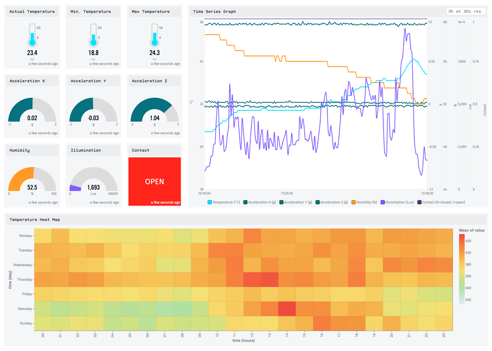

# EnOcean IoT Starter Kit Application Template
This template provides an orchestration and visualization implementation for the [EnOcean IoT Starter Kit](https://www.enocean.com/en/applications/iot-solutions/). The EnOcean IoT Starter Kit contains all of the required hardware and software to provision and receive raw sensor data. This template adds dashboards and a provisioning user interface to make it easy to utilize EnOcean sensors in production smart environment applications.



## Template Features
* Dashboard to instantly visualize data from EnOcean IoT Starter Kit sensors.
* Edge workflows to process and forward EnOcean data to the Losant IoT Platform.
* Customizable user interface to easily onboard and visualize EnOcean sensors.
* Docker Compose file to quickly install the [Losant Edge Agent](https://docs.losant.com/edge-compute/edge-agent-installation/) and [EnOcean IoT Connector](https://iot.enocean.com/) on Linux gateways.

## How it Works
This template demonstrates a complete sensor-to-cloud solution designed for enterprise smart environments. There are several components that work together to seamlessly deliver sensor data from your environment to your IoT applications hosted in the Losant IoT Platform.


### Communication Flow

1. Data is transmitted from an EnOcean sensor to an EnOcean USB stick attached to an Aruba wireless access point.
1. Aruba forwards that data over the local network to the EnOcean IoT Connector running on a Linux gateway.
1. The IoT Connector decodes that data and forwards it to the Losant Edge Agent for any required edge processing and filtering.
1. The Losant Edge Agent forwards that data to the Losant IoT Platform for visualization, alerting, and further application enablement.

## Required Components
To utilize this template, the following components are required:

1. An [EnOcean IoT Starter Kit](https://www.enocean.com/en/applications/iot-solutions/).
1. A supported [Aruba wireless access point](https://www.arubanetworks.com/products/wireless/access-points/). Refer to the [EnOcean documentation](https://iotconnector-docs.readthedocs.io/en/latest/setup-aruba-ap/) for details.
1. A 64-bit Linux gateway. If you do not already have a gateway, we recommend [Lanner](https://www.lanner-america.com/bundle-solutions/losant/).
1. A license (paid or trial) for the [EnOcean IoT Connector](https://iot.enocean.com/).

## Gateway Setup
This template provides a [Docker Compose](https://docs.docker.com/compose/compose-file/) file that makes it easy to install and configure the Losant Edge Agent, EnOcean IoT Connector, and other software dependencies. The file is named `docker-compose.yml` in your [Application Files](https://docs.losant.com/applications/files/). This file is a modified version of the Docker Compose file provided by EnOcean. You can find the original in the [IoT Connector repository](https://bitbucket.org/enocean-cloud/iotconnector-docs/src/master/deploy/local_deployment/docker-compose.yml).

### Configure the Gateway
The only required software to install on your gateway is [Docker](https://docs.docker.com/get-docker/) and [Docker Compose](https://docs.docker.com/compose/install/). Refer to Docker's installation documentation for instructions.

### Configure Losant Edge Agent
Within the Losant portal, navigate to the **Access Keys** main menu and create a new access key. The access key must have publish access to the **provision-response** additional topic. Keep the resulting dialog open or download the credentials somewhere safe as they are needed in the following steps.

Next, open `docker-compose.yml` in any editor, then find and change the following configuration values under the `losant_edge_agent` section:

* `DEVICE_ID`: Set this to the ID of the **Edge Compute** device.
* `ACCESS_KEY`: Set this to the access key obtained above.
* `ACCESS_SECRET`: Set this to the access secret obtained above.

### Configure the EnOcean IoT Connector and Aruba Access Point

The EnOcean IoT Connector has several configuration values that must be specified. Please refer to their [Deploy and Connect Devices](https://iotconnector-docs.readthedocs.io/en/latest/deploy-the-iotc/) documentation, under the **Local Deployment** section, for configuration details. The instructions can be followed as-is with the following exceptions:

1. Skip the **Select the end-point for the IoTC** step. The Docker Compose file provided by this template is already configured to use the Losant Edge Agent's built-in MQTT broker.
1. Stop before the **Onboard devices using the API** step. One of the primary purposes of this template is to provide an onboarding user interface that wraps the IoT Connector's API, so directly using the API is not required.

As part of the IoT Connector instructions, you will run `docker-compose up -d`, which installs all required software. This can take several minutes depending on your gateway performance and internet connection speed. To confirm that the Losant Edge Agent configuration was successful, you can monitor the **Edge Compute** device in the Losant portal and ensure it connects.

## Enable Application Workflows
Application workflows are disabled by default when an application is created from an import or a template. Therefore, you must enable the `Process Provision Queue` workflow.

## Deploy the Edge Workflows
This template includes two [Edge Workflows](https://docs.losant.com/workflows/edge-workflows/) that must be deployed to the **Edge Compute** device. Navigate to the workflow editor for both edge workflows, click the **Deploy** button at the top right of the page, and select the **Edge Compute** device in the deploy dialog.

## Provision your EnOcean IoT Starter Kit Devices
This application template includes a complete End User Experience to provision and visualize data from your EnOcean sensors.

You can access this experience by navigating to the following URL:

```
https://<your-application-id>.onlosant.com
```

You can easily obtain this URL by navigating to the **Edit** main navigation menu under the **Experiences** section.

This template comes with a built-in [Experience User](https://docs.losant.com/experiences/users/) with the following credentials:
* `Username`: test.user@example.com
* `Password`: qwerty123

After logging in for the first time, you'll be redirected to the provision form. Enter the details for your specific EnOcean device and click the **Submit** button. Once provisioned, you can navigate back the home page by clicking the link in the top left corner. If everything has been configured correctly, data will begin showing up on each dashboard. To provision additional devices, click the **Provision Device** link in the header.

## License

Copyright &copy; 2021 Losant IoT, Inc. All rights reserved.

Licensed under the [MIT](https://github.com/Losant/losant-templates/blob/master/LICENSE.txt) license.

https://www.losant.com