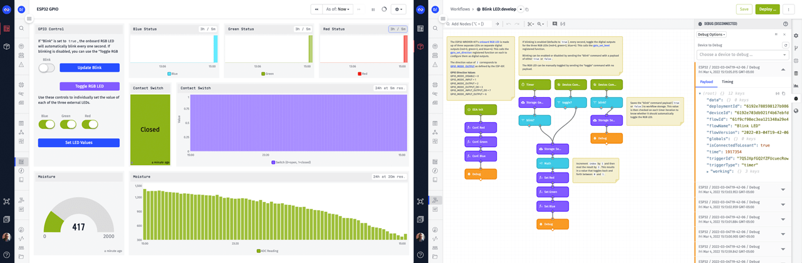
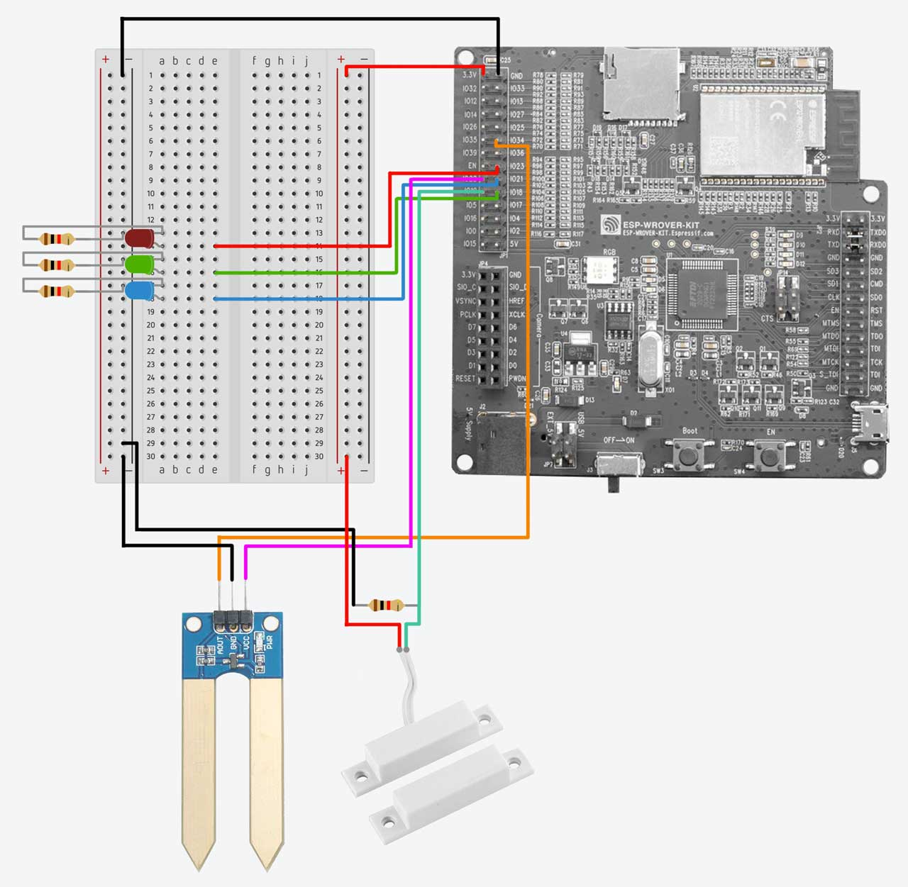

# ESP32 & Embedded Edge Agent
This template demonstrates how to use the Losant [Embedded Edge Agent (EEA)](https://docs.losant.com/edge-compute/embedded-edge-agent/overview/) to remotely monitor and control an ESP32's GPIO using Losant's drag-and-drop [Embedded Workflows](https://docs.losant.com/workflows/embedded-workflows/). This template is designed to provide implementation and architectural guidance for organizations that wish to utilize the ESP32 as the primary module for their connected products.

For users that are new to Losant or the EEA, this template has a [step-by-step tutorial](https://www.losant.com/blog/drag-and-drop-remote-controlled-gpio-for-esp32) that you can follow.

## Key Components
* Example [ESP32 firmware](https://github.com/Losant/eea-examples/tree/main/esp32) that implements the [Embedded Edge Agent](https://docs.losant.com/edge-compute/embedded-edge-agent/overview/).
* Set of [Registered Functions](https://docs.losant.com/edge-compute/embedded-edge-agent/agent-api/#registered-function-api) that wrap the ESP32's underlying [GPIO](https://docs.espressif.com/projects/esp-idf/en/latest/esp32/api-reference/peripherals/gpio.html) and [ADC](https://docs.espressif.com/projects/esp-idf/en/latest/esp32/api-reference/peripherals/adc.html) functionality.
* Embedded Workflow to blink and control the [ESP32-WROVER-KIT's](https://docs.espressif.com/projects/esp-idf/en/latest/esp32/hw-reference/esp32/get-started-wrover-kit.html) onboard [RGB LED](https://docs.espressif.com/projects/esp-idf/en/latest/esp32/hw-reference/esp32/get-started-wrover-kit.html#rgb-led).
* Embedded Workflow to read a variety of digital and analog inputs and report their values to the Losant platform.
* Dashboard to remotely monitor and control your ESP32.

## Required Hardware
This template recommends the [ESP32-WROVER-KIT](https://docs.espressif.com/projects/esp-idf/en/latest/esp32/hw-reference/esp32/get-started-wrover-kit.html), which can be purchased from [Adafruit](https://www.adafruit.com/product/3384). The EEA requires 1-2MB of memory, so any ESP32 module with additional PSRAM is supported.

This template comes with two [Embedded Workflows](https://docs.losant.com/workflows/embedded-workflows/). The **Blink LED** workflow is designed to use the onboard RGB LED that comes with the ESP32-WROVER-KIT. This does not require any additional hardware.

The **GPIO** workflow demonstrates reading and controlling a variety of inputs and outputs. This workflow can be modified to match your specific ESP32 I/O configuration. By default, it assumes the following inputs and outputs are connected to the ESP32.

* **Digital Outputs**
  * Onboard RGB LEDs: Red (0), Green (2), Blue (4)
  * External LEDs: Red (23), Green (18), Blue (21)
  * Voltage output for the moisture sensor (34)
* **Digital Input**
  * Magnetic contact switch (19)
* **Analog Input**
  * Moisture sensor (ADC1, Channel 6)

## ESP32 Firmware
The firmware required to implement the EEA for this template can be found in the following repository:

https://github.com/Losant/eea-examples/tree/main/esp32

Please follow the steps in that repository's README to configure and flash the firmware to your ESP32.

### Device ID, Access Key, Access Secret

The firmware requires a device ID, access key, and access secret. This template comes with a pre-configured **ESP32** device. To obtain these credentials, create an [Access Key](https://docs.losant.com/applications/access-keys/) for this device and use this device's ID.

## Embedded Workflows
Once the above firmware has been flashed to your ESP32 and the device has connected to the Losant platform, you can deploy this template's [Embedded Workflows](https://docs.losant.com/workflows/embedded-workflows/) to your device.

### Blink LED Workflow
The **Blink LED** workflow toggles the ESP32-WROVER-KIT's [onboard RGB LED](https://docs.espressif.com/projects/esp-idf/en/latest/esp32/hw-reference/esp32/get-started-wrover-kit.html#rgb-led). The RGB LED is controlled using three digital outputs: red (0), green (2), and blue (4).

By default, the workflow will blink the LED automatically on a 1-second interval. This behavior can be changed by sending the device a "blink" [command](https://docs.losant.com/devices/commands/) with a payload of either `true` or `false` to enable or disable automatic blinking.

The workflow also supports a "toggle" command (with no payload) to manually toggle the LED on or off.

The "blink" and "toggle" commands can be sent to your device using the [Input Controls Block](https://docs.losant.com/dashboards/input-controls/) found within this template's **ESP32 GPIO** dashboard.

### GPIO Workflow

*Note: the GPIO workflow contains everything found in the Blink LED workflow, so removing the Blink LED workflow from your device before deploying the GPIO workflow is required.*

The **GPIO** workflow expands on the previous workflow and adds support for the digital and analog inputs pictured in the above wiring diagram. This workflow also introduces [Device State](https://docs.losant.com/devices/state/) and reports data under two scenarios:

1. Periodic snapshots of all I/O on a 60-second interval.
1. Immediately whenever the state of the external LEDs or magnetic contact switch changes.

The combination of capturing periodic snapshots as well as immediately when something changes is a common implementation practice. The snapshots provide historical information for values that don’t change often and the immediate reports allow for real-time alerting and notifications using [Application Workflows](https://docs.losant.com/workflows/application-workflows/). This template uses a 60-second snapshot interval for demonstration purposes, but in most production use cases, the interval would be much longer (e.g. 1 hour).

Any data reported as device state is automatically saved on a [device's attributes](https://docs.losant.com/devices/attributes/). This template's **ESP32** device has preconfigured attributes for the moisture sensor, contact switch, and the state of each external LED.

To change the state of the external LEDs, this workflow implements the "set_output" command. This command includes a payload that is an array of digital output pins and their desired value. This command can be sent to your device using the Input Controls block on the **ESP32 GPIO** dashboard.

## ESP32 GPIO Dashboard
This template's **ESP32 GPIO** dashboard contains everything required to remotely visualize and control your ESP32's GPIO.

The dashboard's [Input Controls Block](https://docs.losant.com/dashboards/input-controls/) can send the "blink", "toggle", and "set_output" commands to control the onboard and external LEDs.

The dashboard also contains various [Gauge Blocks](https://docs.losant.com/dashboards/gauge/) and [Time Series Graphs](https://docs.losant.com/dashboards/time-series-graph/) to visualize the ESP32's current and historical digital and analog values.

## License

Copyright &copy; 2022 Losant IoT, Inc. All rights reserved.

Licensed under the [MIT](https://github.com/Losant/losant-templates/blob/master/LICENSE.txt) license.

https://www.losant.com