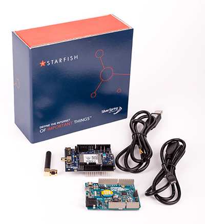

# Itron Milli HDK Temperature Monitor Template
This template provides an out-of-the-box temperature monitoring solution based on the [Itron Milli HDK](https://developer.itron.com/product/milli-developer-kit-v1.0-arduino) and [Temperature Monitor Reference Application](https://developer.itron.com/content/milli-developer-kit-reference-application).

This template is designed to act as a reference implementation for any IoT solution utilizing Itron's Milli architecture and Losant's application enablement platform.

## Itron Milli HDK
The Milli wireless architecture is based on open standards and protocols that allow partners to connect their IoT devices to any number of platforms and systems. The Milli HDK is provided by Itron as a way for device manufacturers to explore and test this functionality.

The Milli HDK is made up of an Arduino and a Milli 5 NIC Arduino shield. The Arduino provides an array of digital inputs and outputs and the shield provides wireless connectivity to an [Itron IoT Edge Router](https://developer.itron.com/product/iot-edge-router-hw1-usa-canada-jamaica-brazil). The IoT Edge Router is responsible for reporting sensor data to Itron's Starfish Platform. The integration between Losant and the Starfish Platform is the foundation of this template.

The [Milli HDK Reference Application](https://developer.itron.com/content/milli-developer-kit-reference-application) demonstrates how to use the the Milli HDK to read and report data from a temperature sensor.

## Key Components

* Dashboard to display temperature data from the Itron Milli HDK.
* Webhook integration between Losant and Itron's Starfish Platform.
* Automatic device creation in Losant whenever a new device reports data from the Itron Starfish Platform.

## Getting Started

1. Set up your Itron Milli HDK by following the [Getting Started Guide](https://developer.itron.com/content/milli-developer-kit-arduino-v10-getting-started-guide).
1. Follow the [Reference Application Instructions](https://developer.itron.com/content/milli-developer-kit-reference-application) to add the temperature sensor to your Milli HDK.
1. Add `clientId`, `clientSecret`, and `solutionName` [Application Globals](https://docs.losant.com/applications/overview/#application-globals). Set these to the corresponding values obtained from the Starfish Platform.
1. Enable the **Milli Temperature** workflow.
1. Open the **Milli Temperature** workflow and click the **Itron Auth Btn** virtual button. This will register the Losant webhook with the Starfish Platform. Review the output of the Debug Panel to confirm the webhook was successfully registered. Once the webhook has been registered, any devices in the Starfish Platform will begin showing up in your Losant application.

## Temperature Dashboard
This template provides a dashboard to quickly view temperature data for any number of Itron Milli HDK devices.

The table at the top of the dashboard contains a list of every Itron Milli HDK device in your Losant application. Clicking a device will switch the dashboard to view sensor information for that device.

---

## License

Copyright (c) 2021 Losant IoT, Inc. All rights reserved.

Licensed under the [MIT](https://github.com/Losant/losant-templates/blob/master/LICENSE.txt) license.

https://www.losant.com