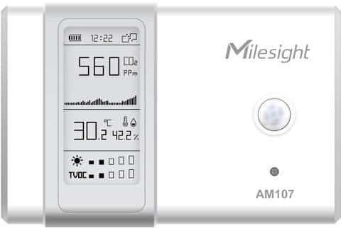
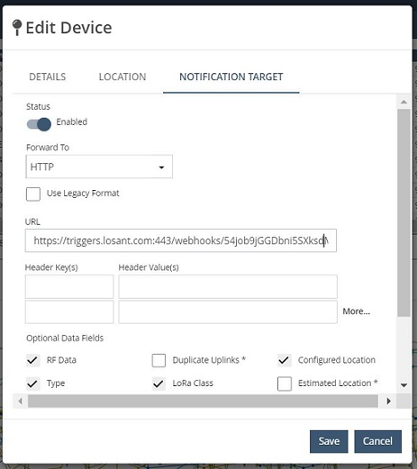
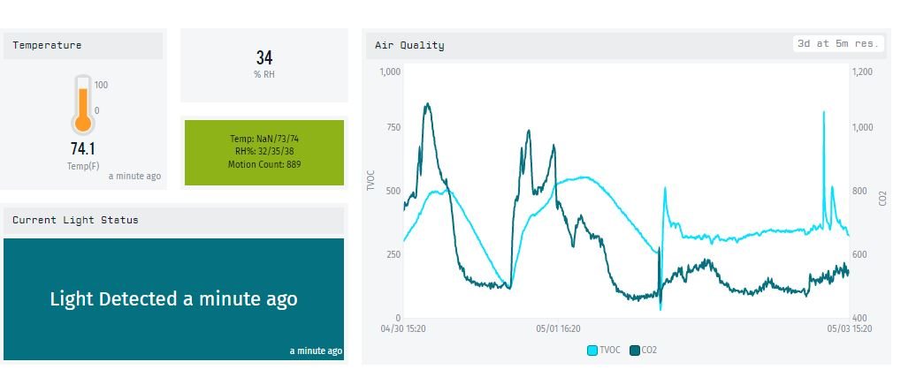

# LoRaWAN and Senet Developer Portal

This application template demonstrates an integration between the [Senet](https://www.senetco.com/) Developer Portal and the Losant IoT Platform. Accounts for the Senet Developer Portal and Losant are available free of charge and provide a simple starting point for experimenting with LoRaWAN IoT solutions.

This template delivers visualization and alerting for a [Milesight AM107 Ambience Monitor](https://www.milesight-iot.com/lorawan/sensor/am100/) for use in Smart Building applications. Even though this template is specific to the Milesight sensor, the underlying implementation can be applied to most other LoRaWAN sensors. This template is a useful starting point for any organization that is interested in developing their own Smart Building application based on LoRaWAN devices.

## Key Components

* Configuring and securing a Senet HTTP integration
* Decoding raw sensor data from Milesight LoRaWAN devices
* Dashboard to visualize live and historical sensor data
* Real-time alerting and event logging on motion detection

## Getting Started

First, [sign up](https://portal.senetco.io) for a free Senet Developer Portal account.

### The LoRaWAN Gateway

When using the Senet Network, a gateway may or may not be needed depending on if your device is in range of an existing Senet gateway. If there are no gateways in range, then you must acquire and configure your own. Senet supports nearly all gateways that support the [Semtech BasicStation](https://docs.senetco.io/dev/gw/BasicStation/) or [Semtech Packet Forwarder](https://docs.senetco.io/dev/gw/SemtechPacketForwarder/) interfaces. A list of gateways that support the custom Senet Gateway Agent is available [here](https://docs.senetco.io/dev/gw/).

Once you have acquired a LoraWAN gateway, you must [register it](https://docs.senetco.io/dev/gw/Registration/) with the Senet Core Network. 

For further information, please see Senet's Developer Portal Video Series: [Onboarding a Milesight UG65 with Semtech Basic Station](https://youtu.be/_chD1X_mcoA).

### Milesight AM107

This template provides an out-of-the-box implementation that supports the [Milesight AM107 Ambience Monitor Sensor](https://www.milesight-iot.com/lorawan/sensor/am100/). 

To purchase your own Milesight sensors, please contact [Milesight Sales](mailto:iot.sales@milesight.com).

1. [Configure](https://resource.milesight-iot.com/milesight/document/am100-series-user-guide-en.pdf) your Milesight AM107.
1. [Onboard](https://docs.senetco.io/dev/dev/) your Milesight AM107 to the Senet Core Network. Be sure to enter 'Milesight-AM107' as the **Device Type** when onboarding. 

For further information, please see Senet's Developer Portal Video Series: [Onboarding a Milesight AM107 to the Senet Developer Portal](https://youtu.be/Q9EHdyuJOJA).

### Configure the Senet Network integration for Losant

A secure connection between Senet and Losant needs to be created. This template automatically creates a unique [webhook](https://docs.losant.com/applications/webhooks/) that you can use to configure your [End-Device Notifier](https://docs.senetco.io/dev/stream/#notification-targets) in the Senet Developer Portal. 

Set the End Device Notifier URL to the URL of the webhook created by this template. For further information, please see Senet's Developer Portal Video Series: [Configuring Losant as the End-Device Notifier](https://youtu.be/ijo-m2rkf10).

## Losant Setup

This template comes with two workflows that must be enabled. Workflows can be enabled by clicking the small toggle icon in the workflow list or by opening the workflow editor and clicking the **Enabled** checkbox on the **Settings** tab.

1. Enable the **Senet Developer - Milesight AM107** workflow.
1. Enable the **Motion Detection Event** workflow.

The Senet Developer Portal Uplink Interface automatically creates new devices the first time it receives data. Once your Milesight sensors are transmitting uplinks to Senet, Senet forwards the payload to Losant automatically.

## Workflow Overview

### Senet Developer - Milesight AM107

When data is received from Senet, this workflow automatically creates a new AM107 device and decodes the received payload. The payload includes information on multiple indoor ambience sensors, including temperature, relative humidity, light, motion, TVOC, and CO2.

### Motion Detection Event

This workflow is used to create events and send emails. Events are created and emails sent to an end-user whenever the AM107 detects motion. This workflow also prevents duplicate events on repeated motion by updating an existing event, if one exists. 

## Device Recipe Overview

### Milesight AM107 Ambience Monitoring Sensor

This recipe contains all the attributes and tags required to create a [Milesight AM107](https://www.milesight-iot.com/lorawan/sensor/am100/) device.

### Senet Uplink API Device Recipe

This recipe contains basic attributes for any device on the Senet Network. It includes attributes that are relevant to a LoRaWAN connected device such as Sequence Number (seqNo), Join ID (joinID) and Device EUI (devEUI).

This is the default device recipe that is used if there is no identifying Device Type on the received payload.

## Custom Node Overview

### AM107 Decoder

This node decodes the AM107-specific payload data received from Senet.

### Senet Uplink API Generic Device Decoder

This node decodes the basic attributes for any device on the Senet Network.

## Dashboard Overview 

The **Milesight AM107** dashboard displays real-time and historical sensor data. This dashboard displays all of the AM107 sensor readings through various informational blocks.

## Events

This template includes a **Motion Detection Event** workflow that will create an event and send an email when motion is detected by the Milesight AM107.

## Reference

Senet is a founding member of the [LoRa Alliance](https://lora-alliance.org/) and the leading provider of cloud-based LoRaWAN&reg; Core Network Services in support of IoT solution providers world-wide, and is an operator of the largest public LoRaWAN&reg; network in the United States.

## License

Copyright &copy; 2022 Losant IoT, Inc. All rights reserved.

Licensed under the [MIT](https://github.com/Losant/losant-templates/blob/master/LICENSE.txt) license.

https://www.losant.com