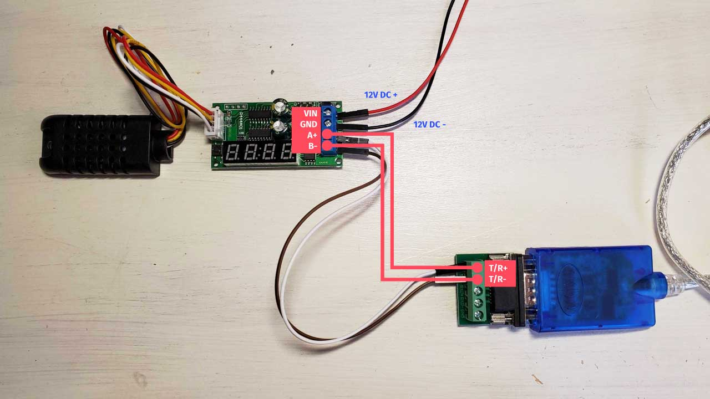

# Modbus Edge Compute with Lanner

This template demonstrates how to read and write [Modbus TCP](https://en.wikipedia.org/wiki/Modbus) and [Modbus RTU](https://en.wikipedia.org/wiki/Modbus) data using [Lanner gateways](https://www.lanner-america.com/bundle-solutions/losant/) and the [Losant Edge Agent](https://~losant-docs-url~/edge-compute/overview/).

This template is designed to act as a hardware and software Modbus development kit. By purchasing the off-the-shelf components listed below, your organization can immediately begin experimenting with Modbus in your own environment. The lessons learned from this template's reference implementation can then be applied to your own Modbus sensors and equipment.


## Key Features
* Example [Edge Workflows](https://~losant-docs-url~/workflows/edge-workflows/) to read and securely transmit Modbus TCP and Modbus RTU data.
* Modbus TCP simulation script that can be run on your network to closely represent real devices.
* Example Modbus RTU workflow that reads data from an off-the-shelf [Modbus RTU Temperature Sensor](https://www.amazon.com/dp/B078NRYBVZ).
* Dashboards to visualize Modbus TCP and Modbus RTU data.
* Local control to automatically write Modbus registers based on sensor values.

## Required Components
To use all features of this template, the following components are required:

* [LEC-7242 Lanner Gateway](https://www.lanner-america.com/bundle-solutions/losant/)
* [Modbus RTU Temperature Sensor](https://www.amazon.com/dp/B078NRYBVZ)
* [RS-485 to USB Adapter](https://www.amazon.com/gp/product/B005CPLOVW)
* [12V DC Power Adapter with Screw Terminals](https://www.amazon.com/dp/B01AZLA9XQ)
* [Male to Male Jumper Cables](https://www.amazon.com/dp/B01L5UJ36U)
* [Precision Phillips Screwdriver](https://www.amazon.com/dp/B01EOY7LTA)

## Gateway Setup

This template works with nearly any gateway capable of running the [Losant Edge Agent](https://~losant-docs-url~/edge-compute/edge-agent-installation/).

If you purchased the Lanner gateway listed above, it comes with the Losant Edge Agent preinstalled. You can find configuration instructions located on the gateway at `/var/lib/losant-edge-agent/README.txt`.

If you're using a different gateway, you must install the Losant Edge Agent by following the instructions below.

1. [Install Docker and the Losant Edge Agent](https://~losant-docs-url~/edge-compute/edge-agent-installation/)
1. [Allow Docker to Access Serial Devices](https://www.losant.com/blog/how-to-access-serial-devices-in-docker)

## Losant Edge Agent Configuration

The minimum [Edge Agent Configuration](https://~losant-docs-url~/edge-compute/edge-agent-usage/) required for this template is a device ID, access key, and access secret.

This template automatically adds an [Edge Compute](https://~losant-docs-url~/devices/edge-compute/) device named "Lanner Gateway". You can obtain its device ID by navigating to its device page and clicking the small copy button at the top of the page near the device name.

To create an [Access Key and Secret](https://~losant-docs-url~/applications/access-keys/) for this device, click the **Device Actions** menu on the top left of the screen and select **Create Access Key**.

Your final Edge Agent configuration file will look something like the following:

```
[gateway]
id = 'YOUR_DEVICE_ID'
key= 'YOUR_ACCESS_KEY'
secret = 'YOUR_ACCESS_SECRET'
```

You can now run the Edge Agent on your gateway. Monitor the [Device Communication Log](https://~losant-docs-url~/devices/overview/#device-communication-log) to see when it successfully connects to Losant. Once it has successfully connected, you can continue with these instructions.

## The Modbus TCP Simulator

This template provides a simple Modbus TCP simulator script that can be used to experiment with both reading and writing Modbus registers. This script can be installed and run on nearly any computer on your network.

The script is written in [Node.js](https://nodejs.org), so you must first install Node.js on the same computer that will run the simulator script. Node.js is installed as a command line tool, so running the simulator script will require some knowledge of using a terminal.

### How to Install the Modbus TCP Simulator Script

1. Create a new and empty folder on the computer that will run the simulator. The folder can be located wherever you want.
1. Navigate to this application's [Files](https://~losant-docs-url~/applications/files/) and download `index.js` and `package.json` into the newly created folder.
1. Open a terminal and change the directory to the newly created folder. Next, run the command `npm install`. This command installs all required dependencies for the simulator script.

### How to Run the Modbus TCP Simulator Script

Once the simulator is installed, you can run it using the following instructions:

1. Open a terminal and change the directory to where the simulator is installed.
1. Run the command `node index.js`. This launches the simulator and prints messages whenever a client connects, reads registers, or writes registers.

### How to Use the Modbus TCP Simulator

This template creates a [Peripheral](https://~losant-docs-url~/devices/gateways-peripherals/) device named "Modbus TCP Sensor". This is the device that represents the Modbus TCP Simulator.

#### Configure the Modbus TCP Device

To communicate with the Modbus TCP Simulator, the Losant Edge Agent needs to know its IP address and port. This is done using the `address` and `port` tags on the "Modbus TCP Sensor" device.

Navigate to the device page for the "Modbus TCP Sensor" device and set the `address` tag to the IP address of the computer that is running the simulator (e.g `192.168.1.101`). The `port` tag on the device is already set to `502`. As long as you have not edited the simulator script, the port value does not need changed.

#### Deploy the Modbus TCP Edge Workflow

This template provides a workflow named "Modbus TCP". This workflow is designed to communicate with the Modbus TCP simulator. It's configured to use the `address` and `port` tags on the peripheral device to know how to connect to the simulator.

To deploy the "Modbus TCP" workflow to your gateway, open the workflow using the workflow editor. Use the **Deploy** button at the top-right of the screen to deploy the workflow to your gateway.

Once deployed, this workflow will read the `temp_c`, `humidity`, and `running` registers from the Modbus TCP simulator every 90 seconds.

#### Changing the Modbus TCP Simulator Values

To change the simulator values, you must first enable the "Update Simulator" workflow. [Application Workflows](https://~losant-docs-url~/workflows/application-workflows/) that are created by templates are always disabled by default.

This template creates a dashboard named "Modbus TCP". This dashboard contains an [Input Controls Block](https://~losant-docs-url~/dashboards/input-controls/) that can be used to send a command to your gateway that will, in turn, write the `temp_c`, `humidity`, and `running` registers on the Modbus TCP simulator. The updated values will be read on the next read interval (i.e. every 90 seconds).

#### Automatically Write Modbus Registers with Edge Logic

The "Modbus TCP" workflow contains a rule that will automatically set the `running` register to `0` whenever `temp_c` goes above `90`. This demonstrates a real-world scenario where a machine may need to be turned off to prevent damage under certain circumstances.

This can be demonstrated by using the input controls block on the "Modbus TCP" dashboard and selecting a value above `90` for temperature. When the Modbus registers are read on the next read interval, the `running` attribute will be automatically set to `0`.

This is designed to demonstrate how Edge Workflows can be used for offline and local control. Edge Workflows continue to run even if the connection to the Losant platform is lost.

## The Modbus RTU Temperature and Humidity Sensor

The Modbus temperature and humidity sensor communicates using RS-485. Although many gateways directly support RS-485, the USB adapter offers a more versatile solution that works with nearly any gateway with standard USB ports.

### Wiring Modbus RTU Sensor to USB Adapter and 12V Power

To use the Modbus RTU sensor, it needs connected to the USB adapter and 12V DC power supply.



1. Remove the sensor board from the white plastic enclosure.
1. Connect `A+` on the sensor board to `T/R+` on the serial adapter.
1. Connect `B-` on the sensor board to `T/R-` on the serial adapter.
1. Plug the sensor's 4-pin connector into the sensor board.
1. Ensure the 12V DC power supply is **not** plugged in to any outlet.
1. Connect `VIN` on the sensor board to the positive terminal the 12V DC power supply.
1. Connect `GND` on the sensor board to the negative terminal on the 12V DC power supply.
1. (Optional) Put the sensor board back in the plastic enclosure while carefully feeding the wires through the small gaps on either end.
1. Connect the USB cord to the serial adapter.
1. Plug the 12V DC power supply into an outlet. Ensure the sensor powers up correctly by waiting a few seconds until a sensor value is displayed on the LCD screen. The small button on the sensor board will toggle the display between temperature and humidity. The LCD displays one decimal place and then an `h` or `c` depending on which sensor is being viewed. For example, `23:3c` is interpreted as `23.3 degrees Celsius`.
1. Plug the USB cord into a USB port on your gateway.
1. Ensure the gateway sees the device by running the commmand `sudo ls /dev/serial/by-id` on the gateway. You should see an item that starts with `usb-FTDI...`.

### Configure the Modbus RTU Device

To communicate with the Modbus RTU sensor, the Losant Edge Agent needs to know the local path to the serial interface (e.g. `/dev/serial/by-id/<your-device>`).

Using the command `sudo ls /dev/serial/by-id`, find the full path to your specific Modbus RTU device. The name should begin with `usb-FTDI`.

Navigate to the device page for the "Modbus RTU" device that has been created by this template. Set the `serial_path` tag to the full path of your serial interface.

#### Deploy the Modbus RTU Edge Workflow

This template provides a workflow named "Modbus RTU". This workflow is designed to communicate with Modbus RTU devices and is configured to use the `serial_path` tag on the device to know how to connect to the sensor.

To deploy the "Modbus RTU" workflow to your gateway, open the workflow using the workflow editor. Use the **Deploy** button at the top-right of the screen to deploy the workflow to your gateway.

Once deployed, this workflow will read the `temp_c` and `humidity` registers from the Modbus RTU sensor every 90 seconds.

## Modify for Your Modbus Equipment

The template is designed to demonstrate how Modbus data is read and written using [Edge Workflows](https://~losant-docs-url~/workflows/edge-workflows/). By using a simulator and an off-the-shelf sensor, this template provides a working implementation for pre-defined sources of Modbus data.

Every Modbus device is different. To begin interacting with your own Modbus equipment, the first step is to obtain the documentation that describes its various registers and data types. Once you have that information, you can expand and modify this template based on your unique Modbus equipment.

---

## License

Copyright &copy; 2021 Losant IoT, Inc. All rights reserved.

Licensed under the [MIT](https://github.com/Losant/losant-templates/blob/master/LICENSE.txt) license.

https://www.losant.com