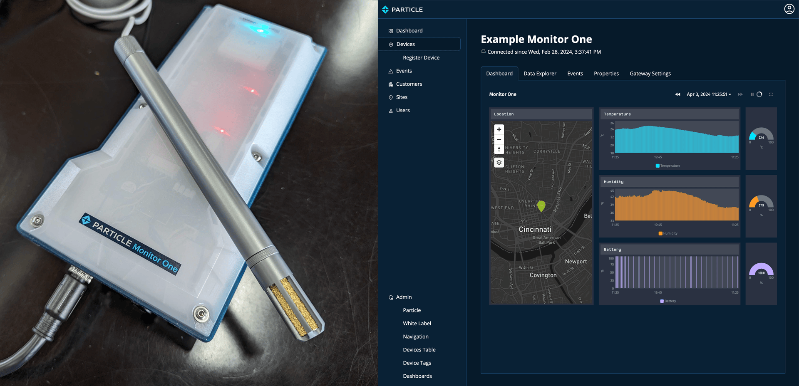
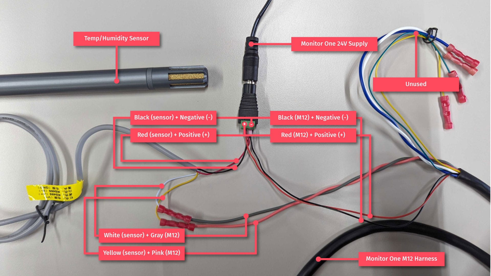
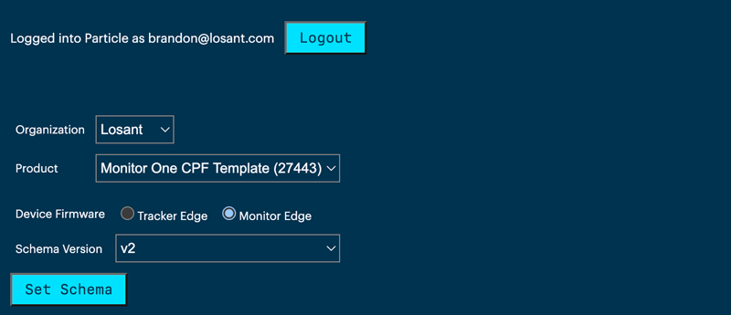

# Particle Monitor One

This template provides a starting point for a multi-tenant and customer-facing application that uses the [Particle Monitor One](https://www.particle.io/devices/monitor-one/). This includes:

* How to receive data from Particle
* How to visualize data using a Losant dashboard
* How to generate events when sensor data exceeds thresholds
* How to configure Monitor One gateways through a custom UI
* How to provision Monitor One gateways across multiple customers and sites

This template is built from the [Connected Product Foundation](https://docs.losant.com/cpf/overview/) (CPF) and includes all CPF functionality.

## Use Case

The Particle Monitor One gateway can be used for any number of use cases. This template provides a reference implementation for reading temperature and humidity from a Modbus sensor. Using the reference implementation as guidance, this template is designed to be modified to meet your specific requirements.

## Monitor One Setup

The following instructions describe how to configure a Particle Monitor One to read temperature and humidity from a Modbus sensor. This template works out of the box with this configuration. If you're new to the Monitor One and Losant, following these instructions is a great way to learn before modifying the implementation for your specific sensors.

### Required Components
* [Particle Monitor One Developer Edition](https://store.particle.io/products/monitor-one)
* [Modbus (RS485) Temperature and Humidity Sensor](https://www.dfrobot.com/product-2279.html)

### Wiring

1. Ensure the power supply is unplugged and the M12 (8-pin) harness is disconnected from the Monitor One.
1. Connect the sensor's **white** wire (RS485 -/A) to the M12's **gray** wire (RS485 -/A).
1. Connect the sensor's **yellow** wire (RS485 +/B) to the M12's **pink** wire (RS485 +/B).
1. Connect **both** the sensor's **black** wire (GND) and the M12's **black** wire (GND) to the **negative** screw terminal on the 24V power supply.
1. Connect **both** the sensor's **red** wire (VIN) and the M12's **red** wire (VIN) to the **positive** screw terminal on the 24V power supply.
1. Plug the M12 harness into the Monitor One.
1. Plug in the 24V power supply to power on both the sensor and Monitor One.

### Monitor One Activation

Follow these steps if you have not already activated your Monitor One and have not already added it to your Particle account.

1. Navigate to [setup.particle.io](https://setup.particle.io/) and click **Get Started**.
1. Select **Monitor One** as the device to set up and then click **Start setting up my device** to continue.
1. Enter your device's serial number, which can be found on the bottom of the Monitor One underneath the magnetic base. The magnetic base can be removed with the included 3mm hex key. Follow the on-screen instructions and wait for the device to blink green.
1. Select your organization (sandbox by default). The Monitor One must reside under a product. Select an existing product or create a new one and press **Add to product**. Continue with the random default name or provide a custom name.
1. The next step activates the Particle device and SIM. This may take some time. Once complete, the setup tool will indicate your SIM has been activated. **Wait until the device is breathing cyan before continuing**.
1. Update the DeviceOS and Monitor Edge firmware. This step flashes DeviceOS v4.2.0 and Monitor Edge v2 to your device. These versions of firmware are required to read data from the temperature and humidity sensor.

### Monitor One Schema

The schema controls which settings are displayed in the Particle Console. This step is required to properly configure the Monitor One to read data from the temperature and humidity sensor.

1. Navigate to the [Configuration Schema Tool](https://docs.particle.io/tools/cloud-tools/configuration-schema/) and log in if prompted.
1. Select the organization and product to which your Monitor One belongs.
1. Select **Monitor Edge** as the Device Firmware.
1. Select **v2** as the Schema Version.
1. Click **Set Schema**. When complete, a "Schema Updated!" message will appear under the button.

## Gateway Settings

In this step you will configure your Monitor One gatway with the required Modbus settings to begin reading data from the temperature and humidity sensor.

1. Navigate to the [Particle Console](https://console.particle.io/) and open the device page for your Monitor One device.
1. Scroll to the bottom of the page and click the **Mark Development** button on the right side. This allows you to change the settings for this specific gateway independently from the product-level configuration.
1. When prompted, confirm the choice by clicking **Yes, Mark as Development Device**.
1. Click the **Gateway Settings** tab to view and modify all available settings.
1. Under the **Modbus RS-485** tab...
    1. Set **RS-485 Baud** to **9600**.
    1. Set **Modbus Inter Message Delay** to **1000**.
    1. Click **Save**.
1. Under the **Modbus Polling 1** tab...
    1. Check the **Modbus Server Enable** checkbox. 
    1. Set **Modbus Server ID** to **1**.
    1. Set **Polling Interval** to **120**.
    1. Set **Modbus Function** to **holding_register**.
    1. Set **Register Address** to **0** (this is the humidity address).
    1. Set **Scaling Value** to **0.1**.
    1. Click **Save**.
1. Under the **Modbus Polling 2** tab...
    1. Check the **Modbus Server Enable** checkbox. 
    1. Set **Modbus Server ID** to **1**.
    1. Set **Polling Interval** to **120**.
    1. Set **Modbus Function** to **holding_register**.
    1. Set **Register Address** to **1** (this is the temperature address).
    1. Set **Scaling Value** to **0.1**.
    1. Click **Save**.
1. Under the **Location** tab...
    1. Set **Maximum location update frequency** to **60**.
    1. Set **Minimum location update frequency** to **3600**.
    1. Check the **Publish on GPS lock** checkbox.
    1. Click **Save**.

You can now switch to the **Events** tab and see Modbus data being published every two minutes and location data being published every hour.

## Template Setup

This template creates a ready-to-use application with an example device, recipe, customers, sites, and users. This template also includes a data simulation workflow and a workflow that generates events based on temperature and humidity threshold data. To begin using this template, the following setup steps are required:

1. Set a password for the system admin user. Within Losant, navigate to **User and Groups** using the left navigation. Click the `system-admin@example.com` user from the list. Click the **Change Password?** checkbox and provide a secure password.
1. Enable the **Simulator**, **Check Thresholds**, **Handle Particle Data**, and **Set Connection Status** workflows.
1. Set a secure value for the `cpf-jwt-password-reset-secret` [Application Global](https://docs.losant.com/applications/overview/#application-globals). This secret is used to sign tokens as part of the forgot password process.
1. Navigate to your experience using your application's default [Experience Slug](https://docs.losant.com/experiences/domains/#experience-slugs) (e.g. `<YOUR_APPLICATION_ID>.onlosant.com`). You can find this link by clicking the **Edit** main left navigation item under the **Experience** section.
1. Log in using the system administrator email and the password you set above.
1. Navigate to the Particle admin page by clicking the **Particle** left navigation item.
1. Provide your Particle Product ID and a [Particle Access Token](https://docs.particle.io/reference/cloud-apis/access-tokens/#getting-an-api-user-token). These are used to retrieve and set your Monitor One's configuration using the UI provided by this template.

This template is based on the Connected Product Foundation (CPF). For all configuration options, please review the [CPF User Guide](https://docs.losant.com/cpf/user-guide/).

## Webhook Integration

This template automatically creates a unique webhook URL that can be used to receive data from Particle.

1. In Losant, click **Webhooks** on the main left navigation.
1. Copy your unique Webhook URL using the small copy icon next to the URL in the table.
1. In Particle, click **Integrations** on the main left navigation, click **Add New Integration**, and then select **Webhook**.
1. This integration is for Modbus events, so name the integration accordingly (e.g. "Losant Modbus").
1. Set **Event Name** to **modbus**. The Monitor One uses the same "modbus" event for both temperature and humidity data.
1. Paste your Webhook URL into the **URL** field.
1. Set **Request Type** to **POST**.
1. Set **Request Format** to **JSON**.
1. Click **Save**.
1. Create another Webhook integration. This one is for location data and uses the same Webhook URL.
1. Name the integration (e.g. "Losant Location").
1. Set **Event Name** to **loc**. The Monitor One sends location data by publishing the "loc" event.
1. Paste the same Webhook URL in the **URL** field.
1. Set **Request Type** to **POST**.
1. Set **Request Format** to **JSON**.
1. Click **Save**.

You can confirm the Webhook is properly configured by clicking **Workflows** in Losant's main left navigation and opening the **Handle Particle Data** workflow. Whenever data is received from Particle it will be displayed in the [Debug output](https://docs.losant.com/workflows/debugging-workflows/). There are currently no devices configured, so the data is not yet being stored, but you can still verify data is received.

## Register Your Monitor One Gateway

With the Webhook configured, data is now being sent from Particle to Losant. However, since there's no matching device added to your application, the messages are being ignored.

If you Monitor One is configured to use the temperature and humidity sensor, you can instantly register your device by logging in to your experience as the system administrator and clicking the **Register Device** left nav item.

1. Name the device anything you'd like and add an optional description.
1. Set the **Particle ID** to the ID of the device as found in the Particle console.
1. Optionally upload an image of the device.
1. Choose **Monitor One** as the **Device Recipe**.
1. Optionally configure temperature and humidity thresholds. More information about thresholds can be found in the next section.
1. Select a **Customer** and **Site** for this device. This template comes with example customers and sites to start with. A device's customer and site can be changed at any time after it's been registered.
1. Click **Submit**.

This device is now registered and the temperature, humidity, battery, and location data received from Particle is being stored on its attributes. You can now view this device's data by clicking on the device's **Dashboard** tab in the experience.

### Registering a Custom Monitor One

If you're registering a custom Monitor One gateway, there are a few additional steps.

1. Follow the steps in the CPF's User Guide for [Registering Devices](https://docs.losant.com/cpf/user-guide/#registering-devices).
1. Create a [Dashboard](https://docs.losant.com/dashboards/overview/) that displays your desired data. Make sure to follow the steps in the CPF User Guide for configuring the required [Dashboard Context](https://docs.losant.com/cpf/user-guide/#required-dashboard-context).
1. Associate your new dashboard with your new device recipe using the [Dashboards Admin Page](https://docs.losant.com/cpf/user-guide/#dashboards-admin-page).
1. Modify the [Devices Table](https://docs.losant.com/cpf/user-guide/#devices-table-admin-page) configuration to display your desired columns.
1. Modify the **Handle Particle Data** workflow to parse your specific events and store the results on your device's attributes. This may also require additional Webhook integrations to be configured through the Particle console for your custom events.

With these steps complete, you can use register your custom Monitor One gateway.

## Threshold Events

This template comes with automatic threshold checking and [Event](https://docs.losant.com/applications/events/) creation. Thresholds are only checked for devices created from the Monitor One recipe provided by this template. If you're using a custom Monitor One gateway and a custom device recipe, you can modify the **Check Thresholds** workflow to incorporate your custom device data.

Incoming data is compared against the following [Device Tags](https://docs.losant.com/devices/overview/#device-tags) to determine whether an event should be created:

1. `threshold_temperature_low`: if the sensor's temperature is less than or equal to this value, an event is created.
1. `threshold_temperature_high`: if the sensor's temperature is greater than or equal to this value, an event in created.
1. `threshold_humidity_low`: if the sensor's humidity is less than or equal to this value, an event is created.
1. `threshold_humidity_high`: if the sensor's humidity is greater than or equal to this value, an event is created.

These values can be set on the device registration page inside your experience and can be changed at any time.

## Monitor One Configuration

This template provides a custom user interface for changing the [Monitor One's Configuration](https://docs.particle.io/reference/tracker/tracker-configuration/#monitor-one-configuration). After a device is registered, you can access the configuration by clicking on the device's **Gateway Settings** tab. If this tab displays an error, please ensure your Particle Product ID and Access Token have been properly configured through the Particle admin page.

By default, this page provides configuration fields specific to reading the temperature and humidity Modbus information. This page provides a subset of the same configuration fields found in Particle's console.

When using a custom Monitor One configuration, you can change these fields by modifying the **m1-element-gateway-settings** [Experience Page](https://docs.losant.com/experiences/views/#pages) and [Experience Workflow](https://docs.losant.com/workflows/experience-workflows/). This page can be accessed by your end users and works well to expose specific configuration fields while keeping other fields private.

## License

Copyright &copy; 2024 Losant IoT, Inc. All rights reserved.

Licensed under the [MIT](https://github.com/Losant/losant-templates/blob/master/LICENSE.txt) license.

https://www.losant.com