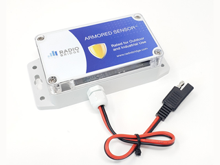
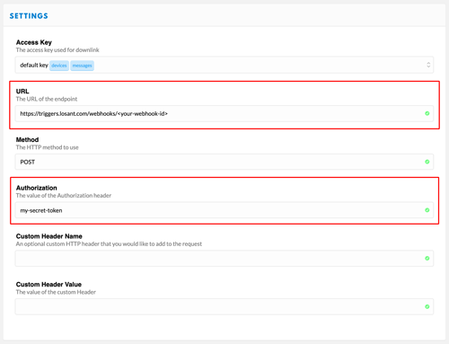

# The Things Network Template

This template demonstrates how to implement visualization and alerting for LoRaWAN devices using [The Things Network](https://www.thethingsnetwork.org/) and the [Radio Bridge Voltage Sensor](https://radiobridge.com/products/wireless-ip67-voltage-sensor). Even though this template is specific to The Things Network (TTN) and Radio Bridge, the underlying implementation can be applied to most other LoRaWAN network servers and sensors.

If you do not have a LoRaWAN device, this template also generates simulation data that mimics the same encoding received from TTN.

This template is a useful starting point for any organization wishing to develop their own IoT product based on LoRaWAN devices.

## Key Components
* Configuring and securing a TTN HTTP integration.
* Decoding raw sensor data from Radio Bridge LoRaWAN devices.
* Real-time alerting based on tamper detection.
* Real-time alerting based on low battery.
* Dashboard to visualize live and historical sensor data.

## Setup
1. Add an [Application Global](https://docs.losant.com/applications/overview/#application-globals) named `LORA_NETWORK_SERVER_AUTH_TOKEN` and set it to a complex string similar to a strong password.
2. Enable the **TTN Receiver** workflow.
3. Enable the **Create Events** workflow.
4. Enable the **Simulator** workflow.

## The Radio Bridge RBS306-VM30 (Voltage Sensor)
This template provides an out-of-the-box implementation that supports the [Radio Bridge RBS306-VM30 Voltage Sensor](https://radiobridge.com/products/wireless-ip67-voltage-sensor). To purchase your own Radio Bridge sensors, please visit the [How to Buy](https://radiobridge.com/how-to-buy) page.

The **TTN Receiver** workflow will automatically create new devices the first time it receives data. Once your Radio Bridge sensors are reporting data to TTN, it will show up in Losant automatically.

## The LoRaWAN Gateway
When using The Things Network, a gateway may or may not be needed depending on whether or not your device is in range of an existing TTN gateway. If there are no gateways in range, then you'll be required to configure your own.

There are many TTN-compatible LoRaWAN gateways available. The gateway you choose does not impact this template. If you plan on using TTN as your production network server, we recommend [The Things Gateway](https://www.thethingsnetwork.org/docs/gateways/gateway/). Follow the instructions provided by your gateway manufacturer to add your gateway to your TTN account.

## Configure the Radio Bridge Sensors
Radio Bridge provides their own free console that integrates with your TTN account and handles adding and configuring sensors. Follow [their instructions](https://radiobridge.com/documents/How%20to%20Connect%20LoRaWAN%20Sensors.pdf) to properly add Radio Bridge sensors to your TTN account.

## Configure The Things Network HTTP Integration for Losant
This template automatically creates a unique [Webhook](https://docs.losant.com/applications/webhooks/) that you can use to configure your [TTN HTTP Integration](https://www.thethingsnetwork.org/docs/applications/http/).

* Set the **URL** to the URL of the webhook created by this template.
* Set the **Authorization** header to the same value you set for the `LORA_NETWORK_SERVER_AUTH_TOKEN` application global.

## Simulation Overview
This template includes a **Simulator** workflow and device. The simulation workflow generates random sensor data every five minutes, encodes that data, and invokes the **TTN Receiver** workflow. This mimics exactly how data is received from TTN by your application.

The **Simulator** workflow also includes two [Virtual Buttons](https://docs.losant.com/workflows/triggers/virtual-button/) to simulate the built-in tamper switch inside Radio Bridge devices. Clicking the **Tamper Open** button will simulate someone attempting to remove the lid and tamper with the sensor. Clicking the **Tamper Closed** button will simulate the tamper button being pushed back down, which indicates the lid has been put back on the device.

## Dashboard Overview
This template includes a dashboard that displays real-time and historical voltage sensor data. It also displays information about the device itself, including battery voltage and a history of the tamper state.

The dashboard is configured with a [Device ID Context Variable](https://docs.losant.com/dashboards/context-variables/#using-device-ids). This context variable defaults to the simulated device. If you add your own Radio Bridge voltage sensor to this application, you can easily view its details by switching the value of the dashboard's context variable.

## Events
This template includes a **Create Events** workflow that will create [Events](https://docs.losant.com/applications/events/) under the following scenarios:

1. **Tamper Detected** - created when a device reports a `tamper` value equal to `0`, which indicates the device is currently being tampered with.
2. **Zero Voltage** - created when the voltage sensor reports a value of `0`. This is useful in power monitoring applications to send an alert if a loss of power occurs.
3. **Low Battery** - created when the battery voltage drops below `2.75` volts.

---

## License

Copyright (c) 2021 Losant IoT, Inc. All rights reserved.

Licensed under the [MIT](https://github.com/Losant/losant-templates/blob/master/LICENSE.txt) license.

https://www.losant.com