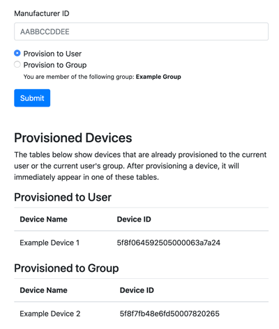

# Dynamic Provisioning
This template provides a base implementation that allows your Experience Users to dynamically provision devices to their own account or the Experience Group in which they belong.

Dynamic provisioning streamlines the user and device onboarding process by allowing users to take ownership of a device after it's been received. This eliminates any need to pre-configure a device prior to shipment, which is useful in scenarios where the hardware or sensor is sold through distributors or other channels.

This template assumes the device is already registered with the Losant platform, but has not yet been provisioned to any user. The concepts in this template can work in conjunction with the Dynamic Registration template to provide a completely automated device onboarding process.

## Provisioning Based on Manufacturer ID
This template implements a common provisioning technique where a user provides a unique ID that's usually found on the device itself. This could be a sticker containing the ID or potentially a QR code that the user can scan.

To incorporate a QR code into your provisioning experience, see the QR Code Reader template.

## The Provisioning Form
This template comes with an example page and form that you can use to test the provisioning functionality.

This template includes two endpoints that are used to render this page and process the user input:

1. `GET /provision`
2. `POST / provision`

This page assumes it is being requested by an authenticated Experience User. Therefore, it is recommended to use this page in an experience that already has authentication and users pre-configured.

### Device Tag Requirements

Devices are provisioned by providing a Manufacturer ID that must match a device with a corresponding `manufacturerId` tag. To test this form, you can create any number of devices in your application with a `manufacturerId` tag set to any value, as long as those values are unique between devices. This is the value that a user will provide when provisioning a device.

### Provision to User

If the user chooses to provision the device to their user account, the device is updated with an `owner` tag that is set to the ID of the current user. This allows applications to quickly find all devices provisioned to a user by querying for devices with the `owner=current_experience_user_id` tag.

### Provision to Group

If the user chooses to provision the device to their group, the device is updated with a `group` tag that is set to the name of the group in which the user belongs. This implementation requires that each Experience Group's devices are configured for all devices that match this tag (e.g. `group=the_group_name`). This allows devices to be dynamically added to a group by setting a tag instead of making changes to the group's configuration.

## License

Copyright (c) 2022 Losant IoT, Inc. All rights reserved.

Licensed under the [MIT](https://github.com/Losant/losant-templates/blob/master/LICENSE.txt) license.

https://www.losant.com

