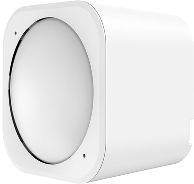

# Aeotec MultiSensor 6
This template contains a [Device Recipe](https://docs.losant.com/devices/device-recipes/) for the [Aeotec MultiSensor 6](https://aeotec.com/z-wave-sensor/) smart home sensor.

## About the Aeotec MultiSensor 6

> One tiny device packed full of intelligence.
>
> A smart home is only truly smart when it’s intelligent. A smart home has to offer more than a schedule; it has to react to what’s occurring in a home in real-time. MultiSensor 6 is the foundation of a modern smart home; within its perfectly small exterior lies all the technology for real-time intelligence.

For more details, see the [Aeotec MultiSensor 6 product page](https://aeotec.com/z-wave-sensor/).

## How to Use a Device Recipe
This template imports a single [Device Recipe](https://docs.losant.com/devices/device-recipes/) into your application. Device recipes allow you to quickly create devices from a predefined set of [Attributes](https://docs.losant.com/devices/attributes/) and [Tags](https://docs.losant.com/devices/overview/#device-tags). Device recipes can be used to create a single device, or used to [create many](https://docs.losant.com/devices/device-recipes/#bulk-device-creation) devices at once.

The `Aeotec MultiSensor 6` device recipe contains all of the recommended attributes and tags when utilizing this sensor within the Losant platform.

## How to Purchase AeoTec MultiSensor 6 Sensors
To purchase AeoTec MultiSensor 6 sensors, visit the [Aeotech MultiSensor 6 product page](https://aeotec.com/z-wave-sensor/).

## License

Copyright (c) 2020 Losant IoT, Inc. All rights reserved.

Licensed under the [MIT](https://github.com/Losant/losant-templates/blob/master/LICENSE.txt) license.

https://www.losant.com