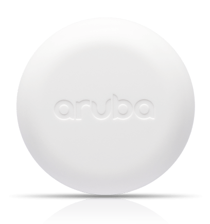

# Aruba Meridian Asset Tag
This template contains a [Device Recipe](https://docs.losant.com/devices/device-recipes/) for a [Aruba Meridian Asset Tag](https://www.arubanetworks.com/products/location-services/aruba-tags/). This recipe is designed to work with the Losant [Aruba Meridian Integration](https://docs.losant.com/applications/integrations/#meridian).

## About Aruba Meridian

> Aruba’s new asset tracking solution can help you quickly locate business critical devices or inventory — like wheelchairs or pallets of retail goods — saving you valuable time and money. Using BLE-enabled Aruba Tags with your location-ready Aruba wireless network, deployment is fast and easy. 

> Your location-ready Aruba wireless network delivers more value with its integrated Bluetooth beacons and radios. This means that BLE-enabled Aruba APs can be a beacon for mobile engagement or a reader for asset tracking. Learn how to leverage your Aruba APs in new ways.

For more details, see the [Aruba Meridian website](https://www.arubanetworks.com/products/location-services/app-platform/).

## How to Use a Device Recipe
This template imports a single [Device Recipe](https://docs.losant.com/devices/device-recipes/) into your application. Device recipes allow you to quickly create devices from a predefined set of [Attributes](https://docs.losant.com/devices/attributes/) and [Tags](https://docs.losant.com/devices/overview/#device-tags). Device recipes can be used to create a single device, or used to [create many](https://docs.losant.com/devices/device-recipes/#bulk-device-creation) devices at once.

The `Aruba Meridian Asset Tag` device recipe contains all of the recommended attributes and tags when utilizing the Aruba Meridian sensors and service within the Losant platform.

## How to Purchase Aruba Meridian Asset Tags
To purchase Aruba Meridian Asset Tags, please visit the [Aruba Meridian](https://www.arubanetworks.com/products/location-services/app-platform/) website and contact their sales team.

## License

Copyright (c) 2022 Losant IoT, Inc. All rights reserved.

Licensed under the [MIT](https://github.com/Losant/losant-templates/blob/master/LICENSE.txt) license.

https://www.losant.com