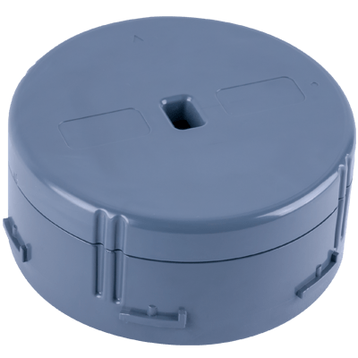

# KST3320 Distance Sensor
This template contains a [Device Recipe](https://docs.losant.com/devices/device-recipes/) for the [KST3320 Distance Sensor](https://kstechnologies.com/kst3320).

## About the KST3320 Distance Sensor

> The KST3320, our LoRaWAN Distance Sensor, is a patent pending device capable of contact-less measurement of solid and liquid levels within 10mm accuracy. It is capable of transmitting that information over short ranges using Bluetooth Low Energy or long range using a variety of Low-Power Wide Area Network (LPWAN). 

> Since the KST3320 is powered by our flexible Unity V4 Engine (KST1120), we are able to offer customization services to meet your particular data or transmission needs. And since the device is generally capable of measuring virtually any object within this accuracy and up to 2-meters away, the KST3320 is an ideal sensor choice for a variety of Internet-of-Things applications.

For more details, see the [KST3320 product page](https://kstechnologies.com/kst3320).

## How to Use a Device Recipe
This template imports a single [Device Recipe](https://docs.losant.com/devices/device-recipes/) into your application. Device recipes allow you to quickly create devices from a predefined set of [Attributes](https://docs.losant.com/devices/attributes/) and [Tags](https://docs.losant.com/devices/overview/#device-tags). Device recipes can be used to create a single device, or used to [create many](https://docs.losant.com/devices/device-recipes/#bulk-device-creation) devices at once.

The `KST3320` device recipe contains all of the recommended attributes and tags when utilizing this sensor within the Losant platform.

## How to Purchase a KST3320 Sensor
To obtain KST3320 distance sensors, please [contact KS Technologies](https://kstechnologies.com/contact).

## License

Copyright (c) 2020 Losant IoT, Inc. All rights reserved.

Licensed under the [MIT](https://github.com/Losant/losant-templates/blob/master/LICENSE.txt) license.

https://www.losant.com