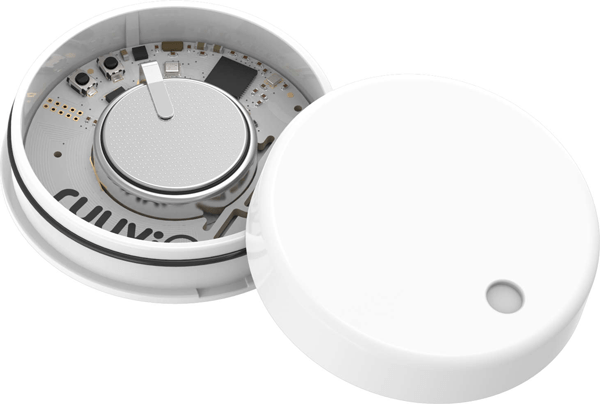

# RuuviTag
This template contains a [Device Recipe](https://docs.losant.com/devices/device-recipes/) for the [RuuviTag](https://ruuvi.com/ruuvitag-specs/) open-source wireless sensor node.

## About the RuuviTag

> RuuviTag is an advanced open-source sensor beacon platform designed to fulfill the needs of business customers, developers, makers, students, and can even be used in your home and as part of your personal endeavours.

> The device is set up to work as soon as you take it out of its box and is ready to be deployed to where you need it.

> Whether you need a beehive monitor in your backyard, or an industrial mesh network asset tracking system, RuuviTag gets you covered.

For more details, see the [RuuviTag product page](https://ruuvi.com/ruuvitag-specs/).

## How to Use a Device Recipe
This template imports a single [Device Recipe](https://docs.losant.com/devices/device-recipes/) into your application. Device recipes allow you to quickly create devices from a predefined set of [Attributes](https://docs.losant.com/devices/attributes/) and [Tags](https://docs.losant.com/devices/overview/#device-tags). Device recipes can be used to create a single device, or used to [create many](https://docs.losant.com/devices/device-recipes/#bulk-device-creation) devices at once.

The `RuuviTag` device recipe contains all of the recommended attributes and tags when utilizing the RuuviTag sensor within the Losant platform.

## How to Purchase RuuviTags
To purchase RuuviTags, please visit [Ruuvi's online store](https://shop.ruuvi.com/product/ruuvitag-1-pack/).

## License

Copyright (c) 2020 Losant IoT, Inc. All rights reserved.

Licensed under the [MIT](https://github.com/Losant/losant-templates/blob/master/LICENSE.txt) license.

https://www.losant.com