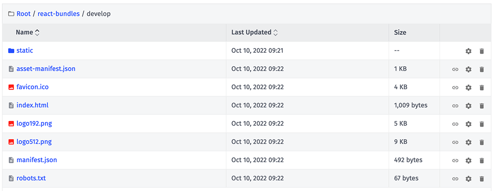

# React.js Experience Bootstrap

This template provides the recommended architecture when using [React.js](https://reactjs.org/) as the front end for your End User Experience.

This template comes with an [example React application](https://github.com/Losant/losant-react-experience) that can be downloaded, reviewed, and deployed as a way to explore this template.

## Architecture Overview

Compiled React bundles are commonly served using a CDN. [Application Files](https://docs.losant.com/applications/files/) are automatically served using a CDN provided by the Losant platform. This template, therefore, provides an opinionated approach to using Application Files to serve your React application.

In most React applications, your front end will communicate with your back end using a REST API. Within Losant, your API can be entirely implemented using [Experience Endpoints](https://docs.losant.com/experiences/endpoints/) and [Experience Workflows](https://docs.losant.com/workflows/experience-workflows/). In most cases, there is no need to host back-end logic anywhere else. This template provides a reference implementation and architecture for a back-end API compatible with a React front end.

### Application Files Folder Structure

Application Files are not tied to [Experience Versions](https://docs.losant.com/experiences/versions/). This means that when a version of your experience is requested, there's no automatic way to know which React bundle to serve. This template provides an opinionated folder structure and the workflow to connect a React bundle stored in Application Files to the version of an experience being requested.

Your compiled React bundles must be uploaded to Application Files in the following location:

```
react_bundles/<version>
```

The `<version>` folders must match the names of your [Experience Versions](https://docs.losant.com/experiences/versions/). Your application will always have the special `develop` version, which is the only version of an experience that can be edited. Your very first React bundle, therefore, will likely go in the following folder:

```
react_bundles/develop
```

As you continue to build and create additional versions, you will also create additional folders:

```
react_bundles/develop
react_bundles/v1.0.0
react_bundles/v1.0.1
react_bundles/v2.0.0
...
```

Below is a screenshot of a compiled React bundle in the `react_bundles/develop` folder.



### Experience Endpoints

All front-end and back-end requests made to your application are served using [Experience Endpoints](https://docs.losant.com/experiences/endpoints/). This template provides a reference architecture to separate API endpoints from your React application's front-end endpoints.

All API endpoints are prefixed with `/api/`. This template includes example endpoints to demonstrate this implementation:

```
POST /api/auth
GET /api/me
GET /api/devices/{deviceId?}
```

This template then includes one additional catch-all endpoint that serves your compiled React bundle:

```
GET /{any*}
```

The catch-all endpoint is designed to facilitate the use of packages like [React Router](https://github.com/remix-run/react-router). Your React application can define any number of routes that are handled client-side and this catch-all endpoint eliminates the need to also define each of those routes as an endpoint. The workflow for this endpoint contains the logic to serve the appropriate `index.html` file based on the requested version. The workflow finds the version in Application Files using the folder structure defined above.

## Building the React Bundle

These instructions assume your React application was bootstrapped using [Create React App](https://github.com/facebook/create-react-app). If you developed your React application differently, these steps may differ, but the concepts are the same.

### Define the PUBLIC_URL Environment Variable

When building your React application, you must define the `PUBLIC_URL` environment variable. This variable tells your React application where your compiled bundle is located.

The value of `PUBLIC_URL` must be set to the full URL of the version folder you previously created in your Application Files. For example, if you're deploying the React application to your experience's `develop` version, the value would be:

```
https://files.onlosant.com/YOUR_APP_ID/react_bundles/develop
```

Therefore, building the resulting React application would use the following command:

```
PUBLIC_URL=https://files.onlosant.com/YOUR_APP_ID/react_bundles/develop npm run build
```

This environment variable should **not** be set when running your React application locally.

The [example React application](https://github.com/Losant/losant-react-experience) uses `.env` files to define these variables. Refer to that repo's README for instructions.

## Deploying Your React Bundle

Now that the React application is built, the contents of the `build` folder must be copied to the corresponding version folder in your Application Files.

The easiest way to accomplish this is to use the [Losant CLI](https://docs.losant.com/cli/overview/). Given the following example local folder structure:

```
|- Project
  |- losant
    |- files
    |- ...
  |- react
    |- build
    |- ...
```

You can build and deploy your React application to the `develop` version using the following command:

```
npm run build && \
rm -rf ../losant/files/react_bundles/develop && \
cp -R ./build ../losant/files/react_bundles/develop && \
losant files upload
```

The above command is doing four things:

1. Building the React bundle. This command is assuming the use of `.env` files to set all required environment variables.
2. Removing the `develop` folder from your `react_bundles` directory locally.
3. Copying the `build` directory to `react_bundles` and renaming it to `develop`.
4. Uploading all the changes to the Losant platform.

Once the upload is complete, this React application is immediately available to your users.

## Authentication and API Requests

This template and the [example React application](https://github.com/Losant/losant-react-experience) include a reference implementation for authenticating an Experience User, storing that user's auth token, and making subsequent authenticated API requests.

The example React application includes a log-in form that makes a request to `POST /api/auth`. The body of the request includes the Experience User's email address and password. If successful, the response includes the user's authentication token.

Upon successful authentication, the user's token is stored in a cookie to eliminate the need to log in again on return visits.

This template includes two example authenticated API endpoints: `GET /api/me` and `GET /api/devices/{deviceId?}`. When the React application makes a request to an authenticated endpoint, the token obtained previously is included in the request through the `Authorization` header.

## License

Copyright (c) 2022 Losant IoT, Inc. All rights reserved.

Licensed under the MIT license.

https://www.losant.com