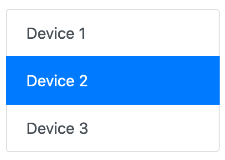
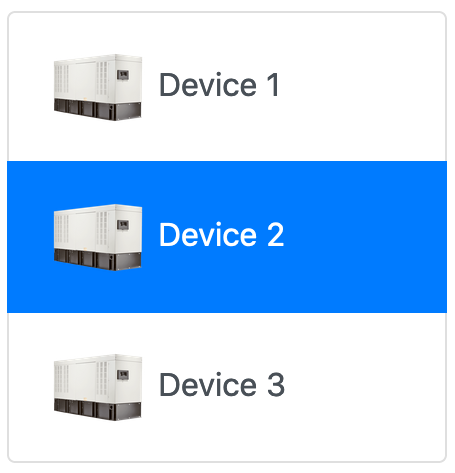
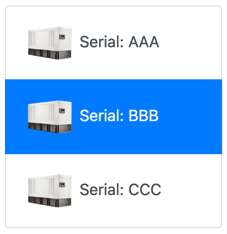

# Device List
This template displays a list of devices. Each entry has a configurable link, label, and optional device image. The list is based on the [Bootstrap 4 List group component](https://getbootstrap.com/docs/4.0/components/list-group/).

## Dependencies

This component requires the use of [Twitter Bootstrap v4](https://getbootstrap.com) as a CSS and JS framework. Losant recommends installing the "Bootstrap 4 Layouts" template in conjunction with this one.

## Usage
This template creates a single [Experience Component](https://docs.losant.com/experiences/views/#components) that can be used within your [Experience Pages](https://docs.losant.com/experiences/views/#pages) or [Experience Layouts](https://docs.losant.com/experiences/views/#layouts).

```
{{component 'tl-device-list' devices [args...]}} 
```



## Configuration

### Context
The [context](https://docs.losant.com/experiences/views/#passing-custom-context) passed to the component must be an array of device objects. The format of these objects must match what is returned by the [Device: Get Node](https://docs.losant.com/workflows/data/get-device/) or the [Losant API](https://docs.losant.com/rest-api/devices/#get). For example:
```
{{component 'tl-device-list' pageData.devices}}
```

### Arguments
This component supports several [arguments](https://docs.losant.com/experiences/views/#passing-custom-arguments) to change its behavior and the data displayed. If the argument supports a template, the context for that template will be set to the specific device object for that entry. The arguments are:

| Property          | Description                                                                                                                                                                                                                                                                          | Default                |
|-------------------|--------------------------------------------------------------------------------------------------------------------------------------------------------------------------------------------------------------------------------------------------------------------------------------|------------------------|
| id                | ([HTML5 ID](https://developer.mozilla.org/en-US/docs/Web/HTML/Global_attributes/id)) The ID of the element into which the component will be rendered. Note: If you are using multiple instances of this component on one page, this property is required and must be unique per instance.    | "tl-device-list"       |
| label             | (String [Template](https://docs.losant.com/workflows/accessing-payload-data/#string-templates)) If set, changes the label that is displayed for each entry. For example, `label="{{this.tags.serial.[0]}}"`.                                                                              | "{{this.name}}"             |
| labelComponent    | (String [Component Name](https://docs.losant.com/experiences/views/#components)) The name of a component to render for each device. The context passed to the component will be the device object. This is used instead of the `label` property to allow for more complex rendering options.|                        |
| selected          | (String) The ID of the device marked as selected. By default, the selected device is highlighted blue. For example, `selected=request.query.device`.                                                                                                                                 |                        |
| link              | (String [Template](https://docs.losant.com/workflows/accessing-payload-data/#string-templates)) The link URL that is applied to each entry in the list. For example, `link="?device={{this.id}}"`.                                                                                        |                        |
| imageFile         | (String [Template](https://docs.losant.com/workflows/accessing-payload-data/#string-templates)) Relative path in your [Application Files](https://docs.losant.com/applications/files/) that contains an image to display for this device. The path must be relative (i.e. `/images/device.png`). The full file URL is added automatically. For example, `imageFile="{{this.tags.image.[0]}}"`.    |                        |
| imageSize         | (Number) Width and height, in pixels, of the device image container. The image is scaled proportionally to fit in this container. For example, `imageSize=50`.                                                                                                                       |                        |

## Examples
The examples in this section are using the context below. For simplicity, not all device fields are shown. It has been reduced to only the fields utilized by the examples. These examples assume that this array of devices is available on the context at `pageData.devices`.

```
[
  {
    "id": "5ed017e09b06870006281ac8",
    "tags": {
      "image": [
        "/device-images/rd05034.png"
      ],
      "serial": [
        "AAA"
      ]
    },
    "name": "Device 1",
    ...
  },
  {
    "id": "5ed017eb9b06870006281ac9",
    "tags": {
      "image": [
        "/device-images/rd05034.png"
      ],
      "serial": [
        "BBB"
      ]
    },
    "name": "Device 2"
    ...
  },
  {
    "id": "5ed017f55aada00006464e1b",
    "tags": {
      "image": [
        "/device-images/rd05034.png"
      ],
      "serial": [
        "CCC"
      ]
    },
    "name": "Device 3",
    ...
  }
]
```

### Basic
A basic device list using a custom link.

```
{{component 'tl-device-list' pageData.devices 
  id='device-list-ex-1'
  selected=request.query.device
  link="/?device={{this.id}}"}}
```


### Device Image
A device list with a device image. The image location is stored on each device's `image` tag.

```
{{component 'tl-device-list' pageData.devices 
  id='device-list-ex-2'
  selected=request.query.device
  link='/?device={{this.id}}'
  imageSize=50
  imageFile='{{this.tags.image.[0]}}'}}
```



### Custom Label
A device list with images and a custom label. The label is set to the value stored on each device's `serial` tag.

```
{{component 'tl-device-list' pageData.devices 
  id='device-list-ex-3'
  selected=request.query.device
  link='/?device={{this.id}}'
  imageSize=50
  imageFile='{{this.tags.image.[0]}}'
  label='Serial: {{this.tags.serial.[0]}}'}}
```



## License

Copyright (c) 2022 Losant IoT, Inc. All rights reserved.

Licensed under the [MIT](https://github.com/Losant/losant-templates/blob/master/LICENSE.txt) license.

https://www.losant.com