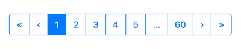

# Paginator

This template provides a general-purpose pagination UI component. This component can be used, for example, as part of a paginated table of devices within your custom experience. The behavior of this component closely mimics the UI on the device list within the Losant platform.



## Dependencies

This component requires the use of [Twitter Bootstrap v4](https://getbootstrap.com) as a CSS and JS framework. Losant recommends installing the "Bootstrap 4 Layouts" template in conjunction with this one.

## Usage

This template creates a single [Experience Component](https://docs.losant.com/experiences/views/#components) that can be used within your [Experience Pages](https://docs.losant.com/experiences/views/#pages) or [Experience Layouts](https://docs.losant.com/experiences/views/#layouts).

```
{{component 'tl-paginator' currentPage=pageData.page totalPages=pageData.totalPages}} 
```

## Component Arguments
This component supports the following [arguments](https://docs.losant.com/experiences/views/#passing-custom-arguments):

| Argument          | Description                                                                                             | Default        | 
|-------------------|---------------------------------------------------------------------------------------------------------|----------------|
| id                | (String) Value for the ID of the root HTML element that makes up this component.                        | "tl-paginator" |
| currentPage       | (Number) The page that should be highlighted as the current page. Values are 1-based.                   |                |
| totalPages        | (Number) The total number of pages that are available. This controls the value for the last page link.  |                |

## Paginator Navigation

Each button in the paginator is a link that appends the selected page on the current URL in the `page` query parameter. All existing query parameters will be maintained. For example, if the user clicks on `3` they will be redirected to:

```
https://example.com/your/path?page=3
```

If your page has an existing query parameter, for example `device`, those parameters will be maintained:

```
https://example.com/your/path?device=myDevice&page=3
```

If you're using the [Device: Get Node](https://docs.losant.com/workflows/data/get-device/) to retrieve pages of devices, you'll need to subtract one from the `page` query parameter. This is because the Device: Get Node is 0-based, which means the first page of devices is at page `0`.

The workflow that is handling your requests is also responsible for validating the provided `page` value. This is because a user can directly edit the URL and provide any arbitrary text as the `page` query parameter (e.g. `?page=foo`).

## License

Copyright (c) 2022 Losant IoT, Inc. All rights reserved.

Licensed under the [MIT](https://github.com/Losant/losant-templates/blob/master/LICENSE.txt) license.

https://www.losant.com