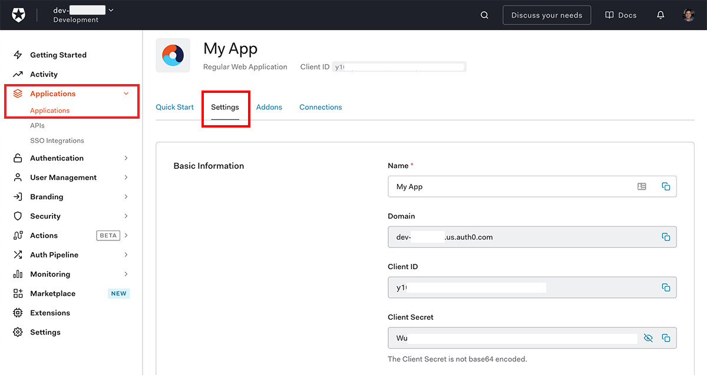
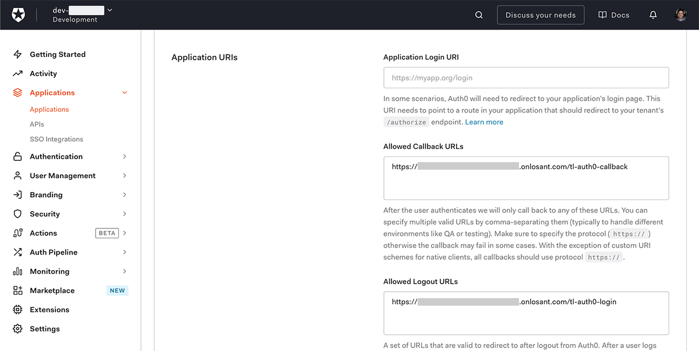
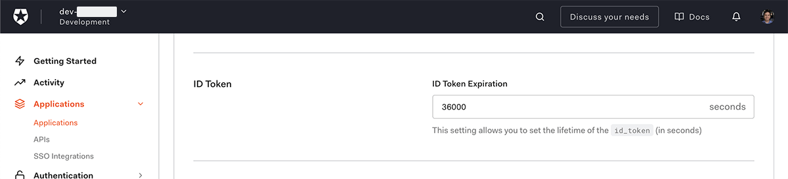
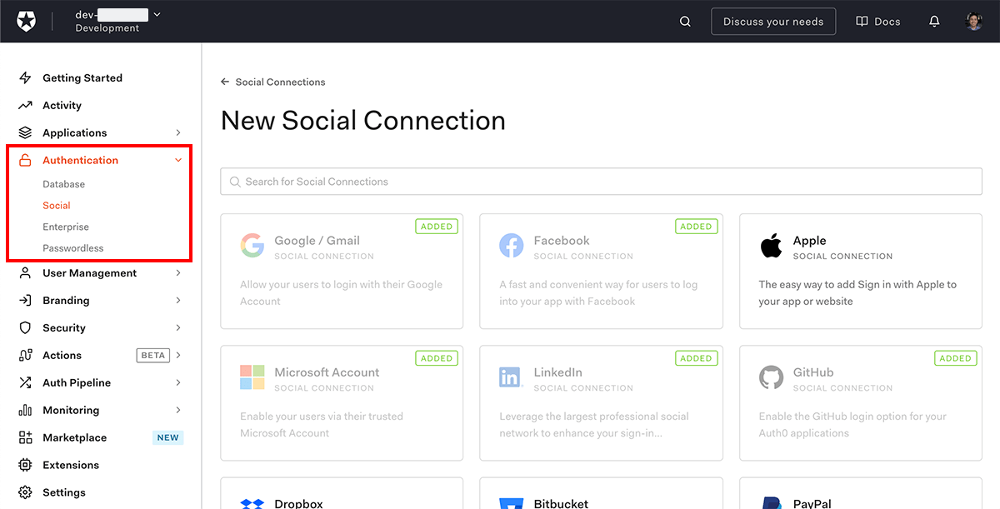

# Auth0 Social Login

This template demonstrates how to use [Auth0](https://auth0.com/) as a third-party login provider for your [Experience Users](https://docs.losant.com/experiences/users/). Auth0 exposes and normalizes a number of third-party [Single Sign-on (SSO) providers](https://auth0.com/docs/sso), along with its own user management service. Utilitizing their service allows developers to very easily accept user sign-ins from a wide variety of SSO providers, including many social media platforms.

## Dependencies

Before you can use this template, you must [create an Auth0 account](https://auth0.com/signup?) and create an application within their platform.

### Losant Dependencies

This template has no additional Losant dependencies, though the interface is tailored to the [Bootstrap 4](https://getbootstrap.com/docs/4.5/getting-started/introduction/) framework, as are all experience-based templates. While not required, we recommend building out your application experiences using this framework.

## Usage

After installation, the template requires a handful of steps to create the connection between Losant and your Auth0 application.

### Auth0 Application Settings

After you have created your Auth0 application, there are a few values from it that must be applied within this template's workflow's globals. The values can be found within the "Basic Information" panel of your Auth0 application's "Settings" page. Copy each of the following values from the panel and paste them into the corresponding workflow global inputs.



- `domain`: The Auth0 application's "Domain".
- `clientId`: The Auth0 application's "Client ID".
- `clientSecret`: The Auth0 application's "Client Secret".

### CSRF Protection

To prevent [Cross Site Request Forgery (CSRF)](https://owasp.org/www-community/attacks/csrf) attacks, you must generate a long, random, alphanumeric string that is used to sign a JWT token sent to Auth0, which then passes the same JWT back to Losant for verification. Within the provided workflow is a Virtual Button that you can use to generate such a string.

Once you have your CSRF string, set it as the value of your `csrfProtection` global variable.

### Default Scope

By default, requests to Auth0 are made with a default [scope](https://auth0.com/docs/scopes/openid-connect-scopes) of "openid profile email", which should return the information necessary to create and authenticate an Experience User. You may adjust this default scope if you'd like by modifying the value of the `defaultScope` workflow global, but bear in mind that:

- The more scopes you request, the less likely a user is to accept the requested permissions.
- Some SSO providers allow users to opt out of specific scopes, so your application cannot assume that, given a user, you will have all of the values for each requested scope.

The scope can also be overridden per login provider by passing a `scope` query parameter through the login endpoint when including a `connection` query parameter. For example, to request permission to read a user's calendar only when signing in through Google, change the URL of the button attached to "Sign In with Google" to:

```
/tl-auth0-login/google-oauth2?scope=openid%20profile%20email%20read:appointments
```

### Optional Path Updates

To prevent conflicts with any existing login endpoints, this template creates endpoints scoped with the `tl-auth0-` prefix. If you wish to change these endpoints, you will need to modify them in the following places within the imported template resources:

- Update the endpoints themselves to the desired paths.
- Within the workflow globals, update the following values:
   - `callbackPath`: The path, in conjunction with the domain from which the request originated, that Auth0 will request after a user signs in to one of your application's SSO providers.
   - `signInPagePath`: The path to the page that displays your sign-in form. Users who sign out will also be redirected to here.
   - `signedInRedirectPath`: The path to redirect users to on successful login. This path should only be accessible to authenticated users.
   - `signOutPath`: The path to your signout endpoint.

### Updates to Auth0 Application

Once you have chosen the paths you'd like to use, return to your Auth0 application's "Basic Information" panel and update the following values:

- **Allowed Callback URLs**: The full URL that Auth0 will request on successful SSO sign-in. If your experience uses multiple domains or slugs, you will need to add multiple values here.
- **Allowed Logout URLs**: The full URL that Auth0 should redirect to after a user signs out. This too requires multiple values if your experience uses multiple domains or slugs.



Optionally, you may also set a custom **Token Expiration**, which is the length of the time (in seconds) that the authorization token will be active. Losant will use this value to generate a token of the same active length when authorizing the Auth0 user as a Losant Experience User.



Make sure to scroll to the bottom of the screen and press "Save Changes" after all fields have been updated.

## Template Resources

This template includes the following resources:

- Four [Experience Endpoints](https://docs.losant.com/experiences/endpoints/) for:
   1. Displaying the Losant experience sign-in page.
   2. Redirecting to the appropriate SSO provider.
   3. Calling back to Losant on successful login with the SSO provider.
   4. Allowing users to sign out.
- One [Experience Workflow](https://docs.losant.com/workflows/experience-workflows/) for negotiating the handshake between Losant and Auth0, and tying the sign-in event to a Losant Experience User.
- Two [Experience Pages](https://docs.losant.com/experiences/views/) for:
   1. Displaying the various SSO provider sign-in options.
   2. Showing the information collected on the signed-in user and allowing them to sign out.

### Defining SSO Connections

This template includes UI buttons for the following SSO providers:

- Google
- Facebook
- Microsoft
- LinkedIn
- Amazon
- GitHub

These providers **will not work** unless the provider has been enabled within your Auth0 application. You can do this under the Authentication -> Social menu. Click the "Create Connection" button in the top right corner, and then add the provider(s) you wish to enable.



Then, within this template's "tl-auth0-login" page, delete the buttons for any providers you have not enabled.

If you wish to add a provider that does not have UI elements included with this template, you will need to:
- Create a button using the inline partial within the template's login page. The "key" corresponds to the provider's "name" as found within your application's "Connections" tab, and the label is a string of your choosing (though it should properly identify the provider by name).
- Add an icon named KEY.png, where `KEY` corresponds with the provider's Auth0 key. Then, place the file in your Application Files under the `/tl-auth0-login/social-icons` directory.

## License

Copyright &copy; 2022 Losant IoT, Inc. All rights reserved.

Licensed under the [MIT](https://github.com/Losant/losant-templates/blob/master/LICENSE.txt) license.

https://www.losant.com