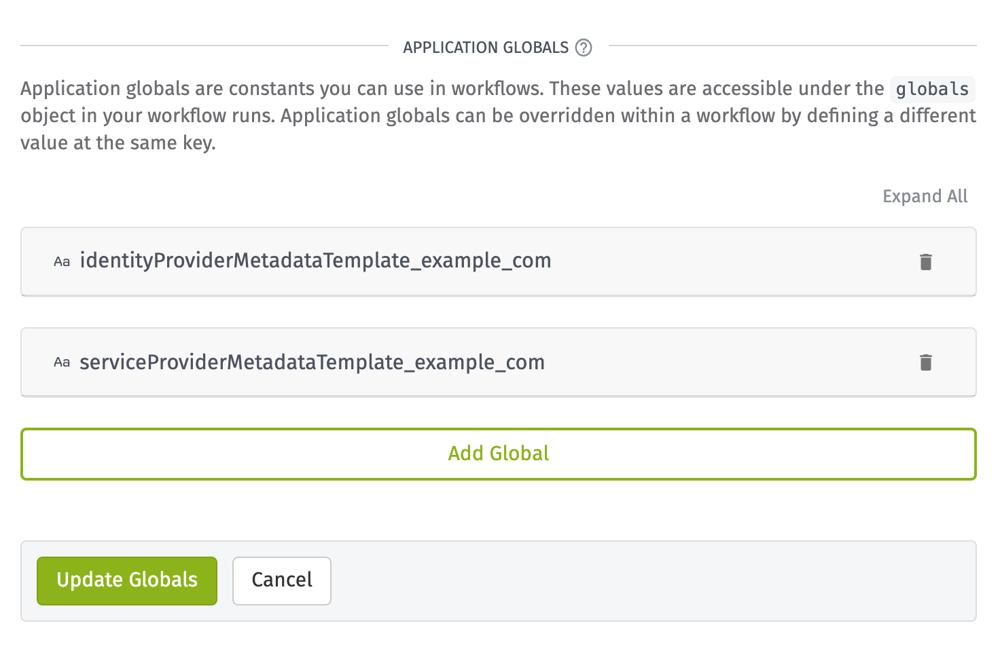

# Azure Active Directory SSO

This template demonstrates how to authenticate to an Experience using [Single Sign-On (SSO)](https://en.wikipedia.org/wiki/Single_sign-on) with [Azure Active Directory](https://azure.microsoft.com/en-us/services/active-directory/).

For step-by-step implementation details, refer to [How to Configure Single Sign-On Within Experiences Using Active Directory](https://docs.losant.com/guides/how-to-configure-single-sign-on-within-experiences-using-active-directory).

## How to Use this Template

When complete, you will have imported the following logic:

1. An Experience User navigates to an Experience Endpoint: `GET /tl-login-sso`.
2. The `GET /tl-saml` Experience Endpoint triggers an Experience Workflow. This workflow generates an Active Directory SSO URL and redirects the user.
3. The Experience User can then authenticate to Active Directory. After a successful login, the user is redirected back to a Losant Experience Endpoint: `POST /tl-saml`.
4. The `POST /tl-saml` Experience Endpoint verifies the request and authorizes the user by [setting the authorization cookie](/experiences/endpoints/#passing-authorization-tokens).

## Configuration

Before you can configure SSO, you first must prepare the proper configuration for the [SAML: Login Node](/workflows/experience/saml-login/) and [SAML: Verify Node](/workflows/experience/saml-verify/).

The two nodes share a common configuration. They both require a:

- [Service Provider Metadata Template](/workflows/experience/saml-login/#service-provider-metadata-template)
- [Identity Provider Metadata Template](/workflows/experience/saml-login/#identity-provider-metadata-template)

### Service Provider Metadata Template

The Service Provider Metadata Template describes the service provider, which in this case is your Losant Experience. Here is an example configuration:

```xml
<EntityDescriptor
  xmlns:md="urn:oasis:names:tc:SAML:2.0:metadata"
  xmlns:saml="urn:oasis:names:tc:SAML:2.0:assertion"
  xmlns:ds="http://www.w3.org/2000/09/xmldsig#"
  entityID="ENTITYID"
>
  <SPSSODescriptor
    protocolSupportEnumeration="urn:oasis:names:tc:SAML:2.0:protocol"
  >
    <!-- insert ds:Signature element (omitted) -->
    <NameIDFormat
    >urn:oasis:names:tc:SAML:1.1:nameid-format:emailAddress</NameIDFormat>
    <AssertionConsumerService
      isDefault="true"
      index="0"
      Binding="urn:oasis:names:tc:SAML:2.0:bindings:HTTP-POST"
      Location="REDIRECT_URL"
    />
  </SPSSODescriptor>
</EntityDescriptor>
```

You can use this example directly or update it to support any application-specific requirements.

Following from the example, you must update the following values:

- `ENTITYID`: Globally unique name for an Identity Provider or a Service Provider. Depending on your environment, there may be a specific `entityId` required. However, in this example, you may set this value to your Experience URL.
- `REDIRECT_URL`: Set to the value of `[Your experience url]/tl-saml`. For example, if your Experience URL was `https://5f3ac1c2d1b1a400075cb42a.onlosant.com`, the value you would configure would be `https://5f3ac1c2d1b1a400075cb42a.onlosant.com/tl-saml`.

**Identity Provider Metadata Template**

Next, you need to acquire an Identity Provider Metadata Template from the identity provider, which in this case is Active Directory:

1. [Add an application to your Azure Active Directory](https://docs.microsoft.com/en-us/azure/active-directory/manage-apps/add-application-portal).
2. [Set up single sign-on (SSO) for an application in your Azure Active Directory](https://docs.microsoft.com/en-us/azure/active-directory/manage-apps/add-application-portal-setup-sso).
3. Download the “Federation Metadata XML.” You can find this within your Azure Active Directory single sign-on application settings:


4. Create or give a user [access to the application within Active Directory](https://docs.microsoft.com/en-us/microsoft-desktop-optimization-pack/appv-v4/how-to-grant-access-to-an-application).

### Setting Global Configuration

It’s best practice to use [application globals](/applications/overview/#application-globals) to store application-wide configuration that may be used across multiple workflows, like phone numbers or API keys. Application globals are a set of key/value pairs that are accessible inside of a workflow.

In this case, you can use them to store the SSO configuration to be used within the SAML Nodes.



## Usage

Once this template is imported and configured, you can test the example form by navigating to `https://<your-app-id>.onlosant.com/tl-login-sso`.


## Resources

- [SAML Tutorial](https://developers.onelogin.com/saml)
- [How SAML Authentication Works](https://auth0.com/blog/how-saml-authentication-works/)

## License

Copyright (c) 2020 Losant IoT, Inc. All rights reserved.

Licensed under the [MIT](https://github.com/Losant/losant-templates/blob/master/LICENSE.txt) license.

https://www.losant.com