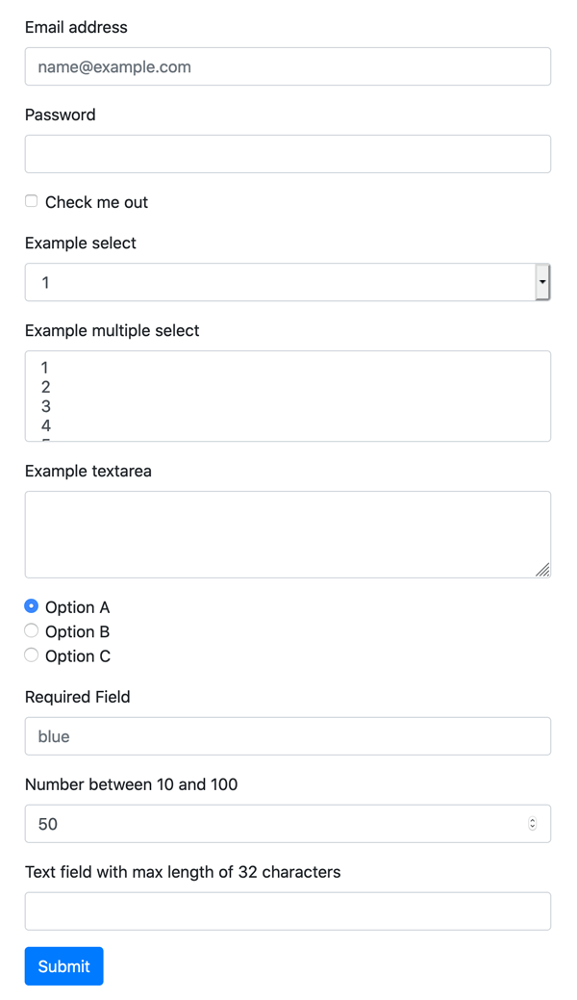

# Basic Form
This template demonstrates how to build a form to receive and process user input using [Losant Experiences](https://docs.losant.com/experiences/overview/).

For more information on forms, refer to [MDN's <form> documentation](https://developer.mozilla.org/en-US/docs/Web/HTML/Element/form). 

## How to Use this Template
The page in this template, `tl-basic-form`, is intended as a reference implementation. It contains many different types of inputs and is designed to be modified or copied into your own pages. This template is not designed to be an out-of-the-box solution, but rather to provide guidance for how forms should be implemented within Losant.

This template also contains an endpoint and a workflow that receives and processes submitted data from the example form. When the form is submitted, the data is POSTed to the `/tl-basic-form` endpoint. That endpoint then triggers the `POST /tl-basic-form` workflow. The workflow contains notes on how to access and process the incoming data.

Once this template is imported, you can test the example form by navigating to `https://<your-app-id>.~losant-endpoint-domain~/tl-basic-form`.

## License

Copyright (c) 2020 Losant IoT, Inc. All rights reserved.

Licensed under the [MIT](https://github.com/Losant/losant-templates/blob/master/LICENSE.txt) license.

https://www.losant.com