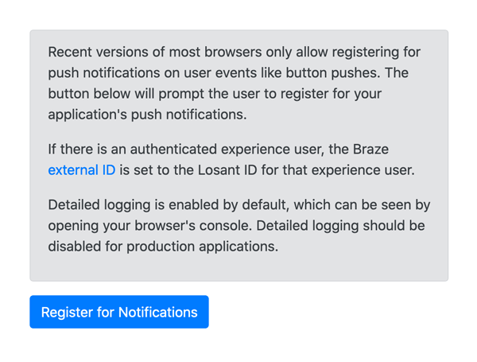

# Braze Web Push Notifications
This template provides an example page that demonstrates how to register for and receive [Web Push Notifications](https://www.braze.com/docs/developer_guide/platform_integration_guides/web/push_notifications/integration/) from the [Braze](https://www.braze.com) customer engagement platform.

## Dependencies
To utilize this template, you need a Braze account. If you do not already have a Braze account, you can contact them at [braze.com](https://www.braze.com).

## Setup
* Create a `tl-braze-sdk-endpoint` [Application Global](https://docs.losant.com/applications/overview/#application-globals) and set it to the [SDK Endpoint](https://www.braze.com/docs/user_guide/administrative/access_braze/sdk_endpoints/) for your Braze instance.
* Create a `tl-braze-api-key`[Application Global](https://docs.losant.com/applications/overview/#application-globals) and set it to the API key for your Braze web app.

For more details on these values, see the documentation for [Initial SDK Setup](https://www.braze.com/docs/developer_guide/platform_integration_guides/web/initial_sdk_setup/).

## Using the Test Page
The test page is best utilized with authenticated Experience Users. By default, the page sets the Braze `external ID` to the Losant ID of the currently authenticated Experience User. This will allow you to target push notifications based on Experience User ID. Most browsers require some form of user interaction before you can prompt them to receive notifications. The test page includes a button that will display the prompt.

## The service-worker.js Workflow and Endpoint
[Service Workers](https://developer.mozilla.org/en-US/docs/Web/API/Service_Worker_API), which enable web push functionality, are required to be hosted from the same domain as your experience. This means the script cannot be loaded from an external CDN or Losant File, since those are not on the same domain as your experience. This template provides the `GET /service-worker.js` endpoint and `GET service-worker.js` workflow that demonstrate how to host JavaScript through your experience, which ensures it comes from the same domain, even when using [custom domains](https://docs.losant.com/experiences/domains/).

## Sending Push Notifications based on Device Data
One of the reasons to utilize Braze within your IoT application is to send push notifications based on your devices' telemetry data. To enable this, import the Braze: Web Push Node, which can also be found in the Template Library. This node allows you to programmatically generate push notifications within your Losant workflows. For example, if a device attribute exceeds a safety threshold, you can send a notification to the Experience User that is the owner of that device.

## License

Copyright (c) 2022 Losant IoT, Inc. All rights reserved.

Licensed under the [MIT](https://github.com/Losant/losant-templates/blob/master/LICENSE.txt) license.

https://www.losant.com
