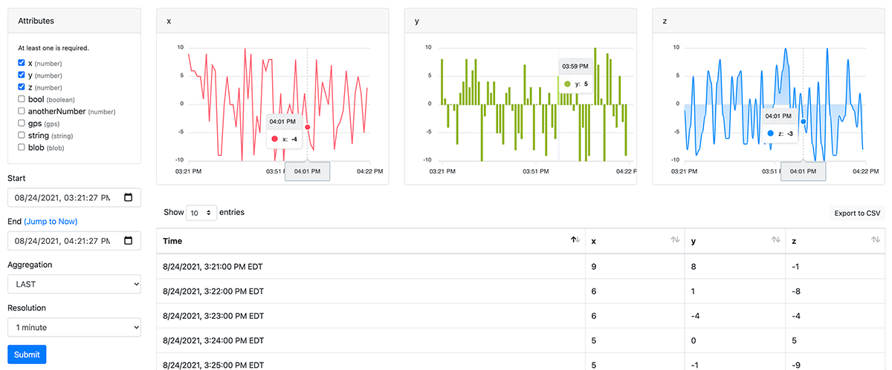

# Data Explorer

This template renders an interface similar to the [Losant Data Explorer](https://docs.losant.com/applications/data-explorer/) for use by your Experience Users. While the template only allows for viewing a single device at a time, it provides an interface for your users to view specific attribute data; to-the-second time ranges, and different aggregation methods and resolution bucket sizes.

## Dependencies

The template makes use of two third-party JavaScript libraries:

- [ApexCharts.js](https://apexcharts.com/) renders the time series graphs for any selected number attributes.
- [DataTables](https://datatables.net/) presents all the selected attribute values and their timestamps in a sortable, exportable table. The plugin requires [jQuery](https://jquery.com/), as does the Bootstrap 4 framework.
- While not required, this template works best when used in conjunction with the [Twitter Bootstrap v4](https://getbootstrap.com/docs/4.6/getting-started/introduction/) framework.

It is not necessary to download these scripts and stylesheets as they are loaded from a [CDN](https://www.cloudflare.com/learning/cdn/what-is-a-cdn/) directly into the Data Explorer page.

## Included Resources

The template includes three resources:

- An [Experience Endpoint](https://docs.losant.com/experiences/endpoints/) for handling initial requests, and form submissions, for the Data Explorer. The ID of the device to view data for is passed as a [path parameter](https://docs.losant.com/experiences/endpoints/#route).
- An [Experience Workflow](https://docs.losant.com/workflows/experience-workflows/) that handles requests to the endpoint; validates user input; retrieves device telemetry data; and issues replies to the requests.
- An [Experience Page](https://docs.losant.com/experiences/views/#custom-pages) for rendering the Data Explorer, including all the necessary client-side scripts.

## Usage

There are a number of configuration options that can be set to limit the exposure of device data to your end users.

### Endpoint Configuration

First, by default, the endpoint is configured to only allow access to authenticated users. If desired, you may adjust the [Access Control settings](https://docs.losant.com/experiences/endpoints/#access-control) to provide the Data Explorer to public users, or only to members of specific [Experience Groups](https://docs.losant.com/experiences/groups/).

You may also wish to change the route to something that better fits your current URL structure (i.e. "/devices/{deviceId}/data"). It is not required to pass the device ID as a path parameter; however ...

- Passing the ID through some other means, such as a query parameter or in a POST body, will require updates to the template resources.
- Including the device ID in the URL provides a predictable and RESTful experience for your end users.

### Workflow Configuration

Within the provided workflow, there are multiple potential changes to make:

- The [Device: Verify Node](https://docs.losant.com/workflows/experience/verify-device/) is used to compare the [Experience User](https://docs.losant.com/experiences/users/) making the request to the device they are attempting to view and verifying that, per their Experience Group membership, the user is [associated with the device](https://docs.losant.com/experiences/groups/#devices) in question. If your application does not make use of Experience Groups for a tenancy model, you should delete the Device: Verify Node and connect the triggers preceding it directly to the [Device: Get Node](https://docs.losant.com/workflows/data/get-device/).
- If you do delete the Device: Verify Node, you should check to make sure the Device: Get Node finds a device in your application using a [Conditional Node](https://docs.losant.com/workflows/logic/conditional/). If the device was not found, the workflow should return a 404 page.
- The workflow includes a basic 404 response currently. This node should be edited to return your application's 404 page. If you do not have one, you can find one in the Template Library as part of the "User-Friendly Error Pages" template.
- If you wish to limit the aggregation methods exposed to your end users, edit the "allowedAggregations" workflow global value to remove any you do not wish to expose. The most common case is to remove the "NONE" option in high-volume state data applications as these can lead to workflow errors when making large data requests (i.e. extra-long time ranges).
- You may also only allow specific attributes to be viewed by your users by creating an "allowedAttributes" workflow global, and setting its value to an array of the attribute names you wish to expose (e.g. `["tempF", "pressure", "humidity"]`). If this global is not set, all of your device attributes will be available.

### Page Configuration

First, if you are making use of layouts in your experience, you will want to alter the imported page as follows:

- Move the `<script>` and `<link>` tags in the page's `<head>` into the `<head>` section of your layout. If you are using the Bootstrap 4 framework, you likely already have the Boostrap stylesheet and script files (including jQuery) in your layout. However ...
   - The DataTables and ApexCharts libraries must be included *after the jQuery declaration* and *before the page content*.
   - Therefore, if your layout includes jQuery above the closing `<body>` tag, it should instead be moved into the layout's `<head>`.
   - You may also wish to conditionally import the DataTables and ApexCharts lines in the `<head>` so that they are not fetched on pages where they are not needed. You can accomplish through `{{#if}}` block helpers checking a condition that indicates the user is currently viewing the Data Explorer; or, you can make use of [`{{section}}` and `{{#fillSection}}` helpers](https://docs.losant.com/experiences/views/#section-helpers).
- Once the scripts are moved to your layout and you have selected your layout to use for the Data Explorer page, delete everything within the page except for the content between the `<body>` opening and closing tags.

Second, using [page tags](https://docs.losant.com/experiences/views/#page-configuration), you may alter the appearance of specific attributes by name, where "ATTRIBUTE_NAME" below is replaced with the attribute you wish to alter.

- `color-ATTRIBUTE_NAME`: This allows for changing the color of the graph for the given attribute. The value should be a valid color string (i.e. in hex format, such as "#ff0000"). If a color is not defined for a specific attribute, the graph will default to blue. 
- `style-ATTRIBUTE_NAME`: This controls the type of graph to render. There are three acceptable values: "bar", "area", or "line". If not provided, the attribute will be represented as a line.

## Graphable Attributes

While the data from all selected attributes will appear in the Data Explorer's table, only `number` and `boolean` [attribute types](https://docs.losant.com/devices/attributes/#attribute-data-types) can be represented in a graph. Any `string`, `gps`, or `blob` attributes cannot be represented as a graph.

**Exception:** When `COUNT` is selected as the data aggregation method, all attributes will return numbers representing the number of times each attribute was reported per resolution bucket. In this case, attributes of all types can be graphed.

## License

Copyright (c) 2021 Losant IoT, Inc. All rights reserved.

Licensed under the [MIT](https://github.com/Losant/losant-templates/blob/master/LICENSE.txt) license.

https://www.losant.com