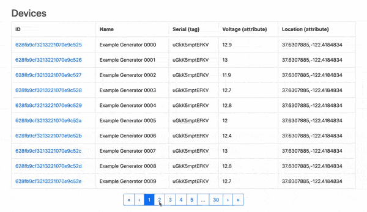

# Paginated Device Table

This template provides a reference implementation for a paginated table of devices.

Displaying a table or list containing thousands of devices is too much data for a user to effectively consume. Querying the details for thousands of devices can also take too long, leading to poor page speeds. The most common solution to this problem is to paginate large collections of devices. This reduces the amount of data a user is required to consume and reduces the number of devices that must be queried. This results in a faster and better overall user experience.

## Dependencies
This template requires [Twitter Bootstrap v4](https://getbootstrap.com/) as a CSS and JS framework. If Bootstrap is not already added to your experience, Losant recommends installing the "Bootstrap 4 Layouts" template.

This template imports a copy of the template library's Paginator component with a different name to prevent conflicts (`tl-device-table-paginator`). If your application already includes the Paginator component (`tl-paginator`), you can delete the copy imported by this template and edit the experience page to use the library's template instead.

## Usage
This template provides a reference Experience [Endpoint](https://docs.losant.com/experiences/endpoints/), [Workflow](https://docs.losant.com/workflows/experience-workflows/), and [Page](https://docs.losant.com/experiences/views/#pages) that demonstrates how a paginated table of devices can be implemented.

Since device tables are usually displayed as part of a larger experience, it's unlikely that this template will be used directly as an out-of-the-box solution. This template provides a baseline implementation that's designed to be modified to suite your specific needs.

## Template Resources
The most important resources included in this template are the reference experience workflow and page. The included experience endpoint (`GET /tl-devices`) has no configuration specific to displaying a device table and is included solely as a way to access the example page. In most applications, the endpoint included in this template will be removed or renamed.

### Experience Workflow
The workflow in this template (`Workflow - GET /tl-devices`) provides a reference implementation that performs the following actions:

1. Validates the page to query based on the `page` query parameter.
1. Queries the corresponding page of devices from your application.
1. Replies to the endpoint request by rendering a page with the queried devices.

You **must** edit the [Device: Get Node](https://docs.losant.com/workflows/data/get-device/) in this workflow to query devices specific to your application.

### Experience Page
The Experience Page in this template (`Page - GET /tl-devices`) contains the HTML and CSS for rendering a table using the collection of devices queried by the workflow, as well as the paginator component for navigating to different pages of results. You **must** edit this page to render the details for your specific device.

In most cases, this page should only be treated as example code that you will copy, paste, and modify as part of a larger experience.

## License

Copyright (c) 2022 Losant IoT, Inc. All rights reserved.

Licensed under the [MIT](https://github.com/Losant/losant-templates/blob/master/LICENSE.txt) license.

https://www.losant.com